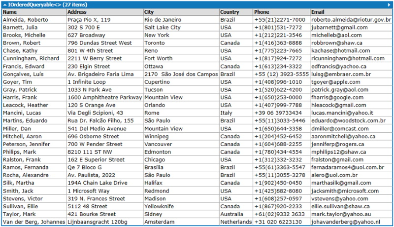
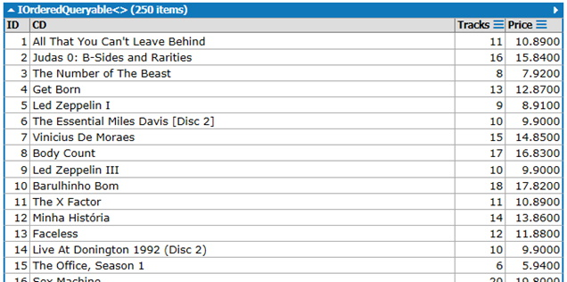
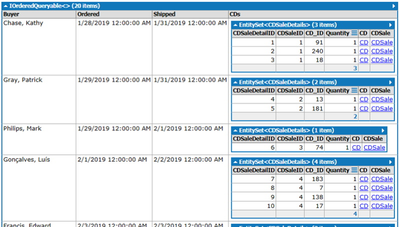

## Instructions
Complete each of the questions below using the exercise **CeeDeeMusic** (**2 marks per query**):
1. Create a list of **Buyers**: 

2. Create a list of **CDs**: 

3. Create a list of **CDSales**: 

## Submission
Save each query as **Class#_EnglishName_Question#** (if your English name is George, you are in Class 1,and you answer question 1, then that query will be called **Class1_George_Question1**).

### [Lesson Home](1_2_0.md)
### [Unit Home](linq.md)
### [DMIT2018 Home](../)