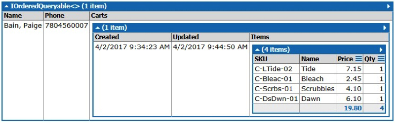

## Introduction
In lesson 1.2.0 you were introduced to creating LINQ queries in LINQPad. In this lesson, you will create some advance LINQ queries in LINQPad. These queries will return data that contains a collection of data, and other advanced LINQ functions.

## Example #1
Consider the following portion of the eStore ERD:<br>


If we wanted to return the `ShoppingCarts` that belong to a selected `Customer`, we could write the following query:

```
var results = from x in Customers
              where x.CustomerID == 11
              orderby x.LastName, x.FirstName
			  select new
			  {
				  Name = x.LastName + ", " + x.FirstName,
				  Phone = x.Phone,
				  Carts = x.ShoppingCarts
			  };
results.Dump();
```

The result of this query is:<br>

The output displays an `EntitySet<ShoppingCart>`, which has  `ShoppingCartItems`. If we expand this, we see:<br>


Also included in the output is `Customer`, which you do not need. You will need `Product` in some part of the query.

The results shown are a result of LINQPad using the navigation properties, which are created from the Primary Key – Foreign Key relationships between the database tables.

## Example #2
Refine the query from the previous example to show just the relevant information. Looking at the output below, what would be the query?<br>


The query has two nested queries; one query for the `ShoppingCart` for the `Customer`, and the second for the `ShoppingCartItems` that are in the `ShoppingCart`:

```
var results = from x in Customers
              where x.CustomerID == 11
              orderby x.LastName, x.FirstName // multi-level sort
              select new
              {
                  Name = x.LastName + ", " + x.FirstName,
                  Phone = x.Phone,
                  Carts = from y in x.ShoppingCarts //nested LINQ query
                          orderby y.UpdatedOn
                          select new
                          {
                              Created = y.CreatedOn,
                              Updated = y.UpdatedOn,
                              Items = from z in y.ShoppingCartItems //nested LINQ query
                                      select new
                                      {
                                          SKU = z.Product.SKU,
                                          Name = z.Product.ProductName,
                                          Price = z.Product.SellingPrice,
                                          Qty = z.Quantity
                                      }
                          } 
              };
results.Dump();
```

## Exercise
Complete Exercise **1.3.1 LINQ Queries Advanced** and upload your queries to Moodle.

### [Unit 1 Home](linq.md)
### [DMIT2018 Home](../)
