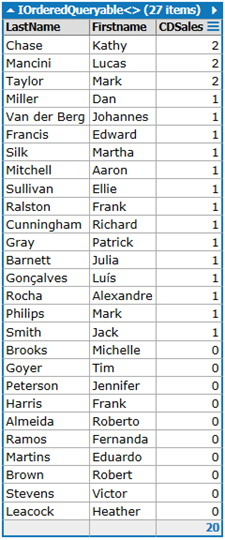
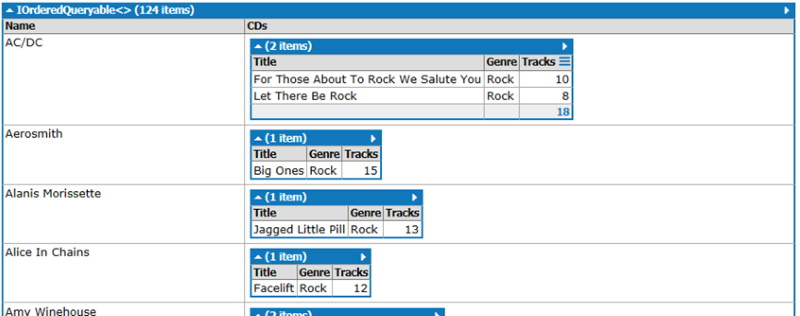
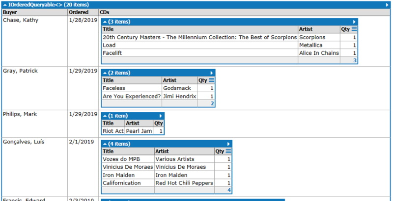

## Instructions
Complete each of the questions below using the exercise **CeeDeeMusic** (**2 marks per query**):
1. Create a LINQ query that will display the following results: 

2.	Create a LINQ query that will display the following results: 

3. Create a LINQ query that will display the following results (Hint: to get just the date use `.ToShortDateString()`): 

## Submission
Save each query as **Class#_EnglishName_Question#** (if your English name is George, you are in Class 1, and you answer question 1, then that query will be called **Class1_George_Question1**).

### [Lesson Home](1_3_0.md)
### [Unit Home](index.md)
### [DMIT2018 Home](../)