## Topics
* [Visual Studio Versions](#versions)
* [Startup Options](#options)
* [Visual Studio Windows](#windows)
* [Format Document](#format)

## <a ID="versions">Versions</a>
There are 2 versions of Visual Studio that will work:
* Visual Studio Enterprise
* Visual Studio Community Edition (free).

The recommended one for this course is **Visual Studio Community Edition**.

## <a ID="options">Startup Options</a>
When Visual Studio first starts up you will get the following screen: 
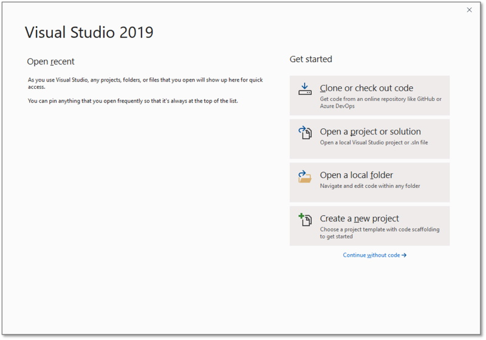

There are some customizations that you can make to Visual Studio by using the **Options** wizard: 
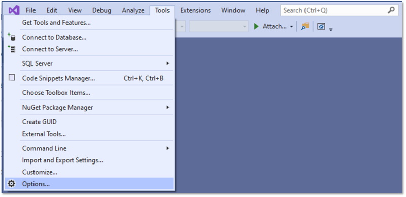

#### Options – Visual Experience
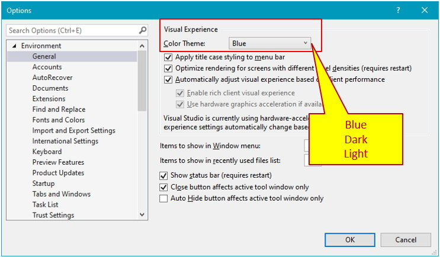

#### Options – Fonts and Colors
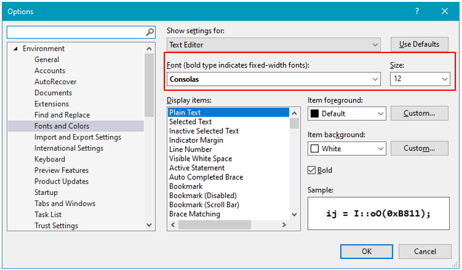

#### Options – Show Start Page

#### Options – Projects and Solutions
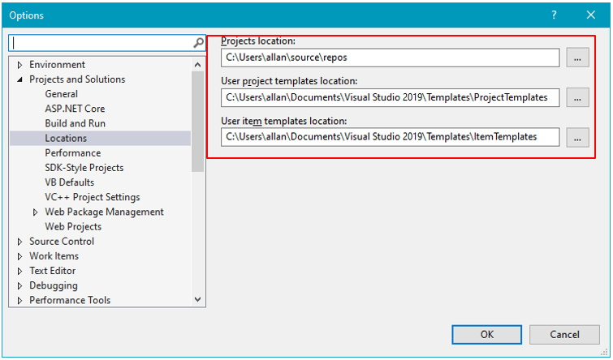

#### Options – Line Numbers
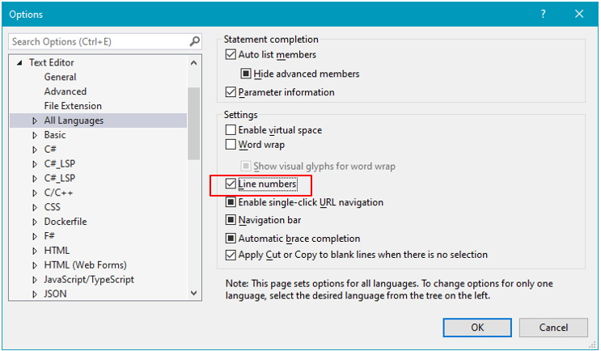

#### Options – Tabs & Spaces
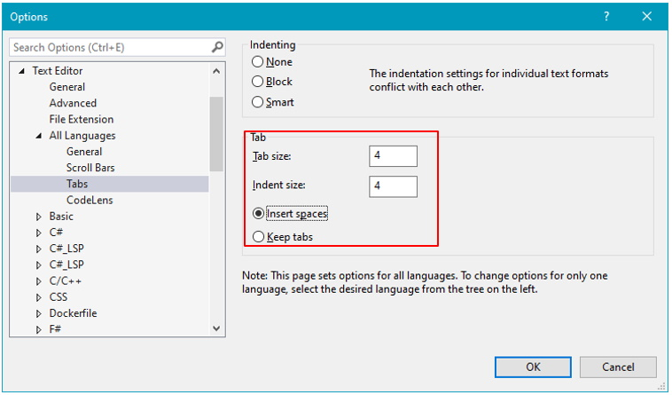

#### Options – Web Forms
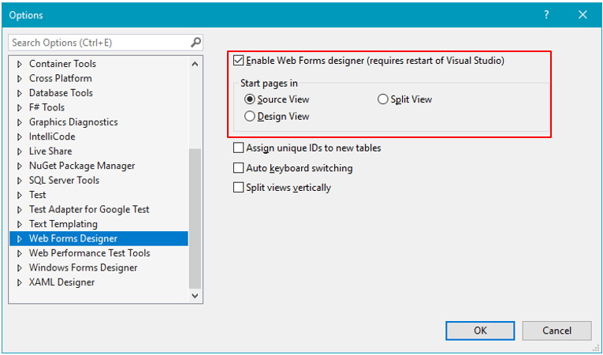

## <a ID="windows">Visual Studio Windows</a>
* Visual Studio can be configured in a variety of ways
* The windows and locations of them shown on the following images are recommended for this course:

#### Recommended Widows Setup
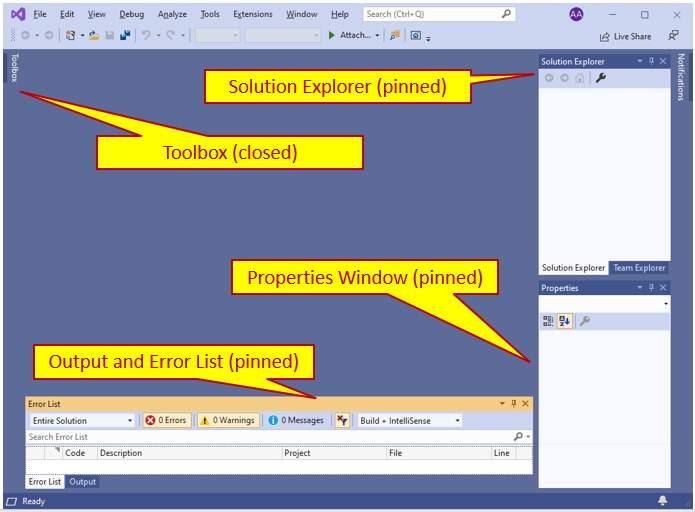

#### Create a New Project
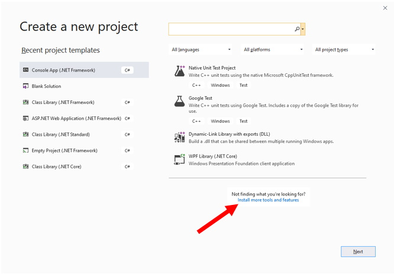

#### Other Windows
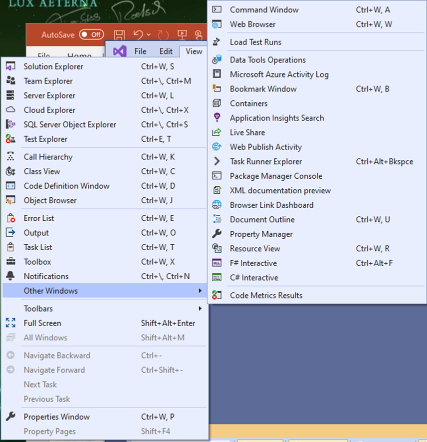

## <a ID="format">Format Document</a>
* It is easy to write code that works, but is hard to read
* Visual Studio has a document formatter that will format your code file for readability
* USE IT!! Or lose marks for code quality!
* The *command* to do correct the formatting is: 
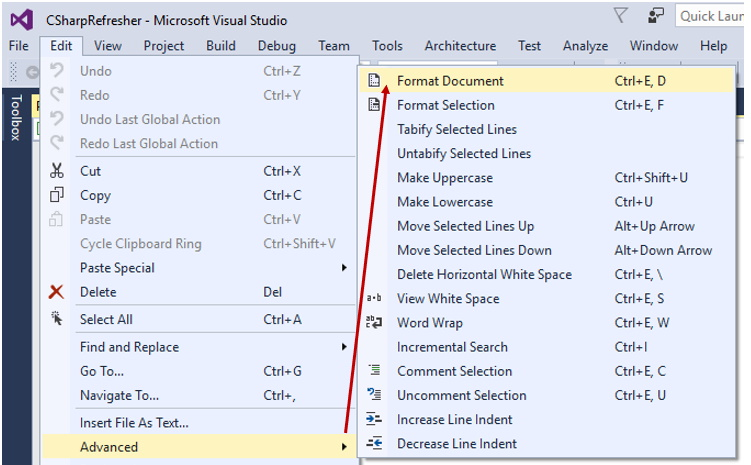

#### Before Formatting
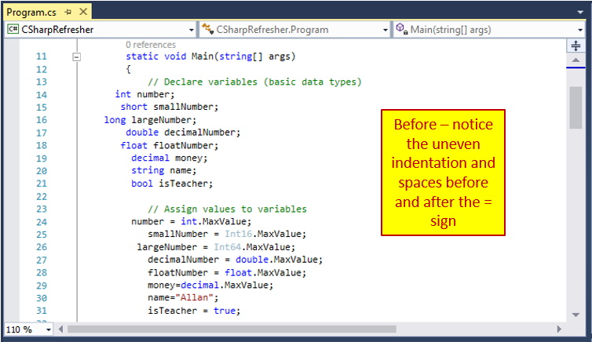

#### After Formatting
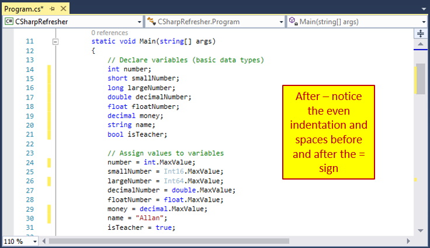

### [Unit 2 Home](vs-solution.md)
### [DMIT2018 Home](../) 