## Introduction
Although not strictly required, the Equation Editor in Microsoft Word is a powerful tool that will enable the student to create nicely formatted equations and the steps in solving the equations. Many of the notes provided to the student use the equation editor.

**When completing your sample solutions in your Project Report, it is very strongly suggested to use the Word Equation Editor to write out the math!**

## Where to Find?
The Equation Editor can be found in the Insert tab of Word: 
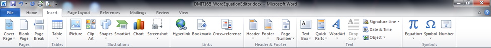

## What is Available?
There are several predefined equations to choose from but mostly the student will be inserting a new equation: 

## Creating a Simple Equation
Select either the Insert New Equation (as shown in the figure above) or just press the Equation Symbol: .

Once selected you will be shown 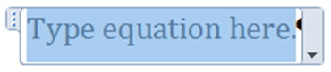 in Word and you will have the Equation Editor palette: 
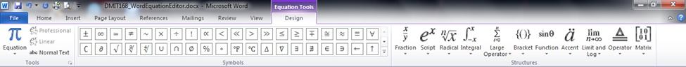

Before starting to create your first equation you should be familiar with the Equation Editor’s palette. First examine the **Symbols**:

The default set of symbols is for Basic Math: 
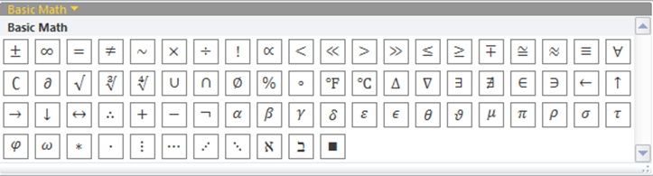

But you have options for other symbols: 
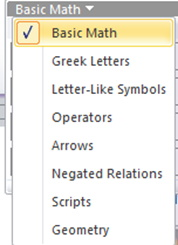

Next, you have the Fraction symbols: 
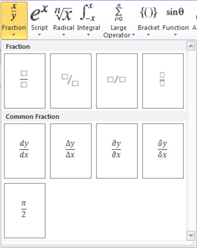

You also have the Script symbols (mainly used for superscripts and subscripts): 
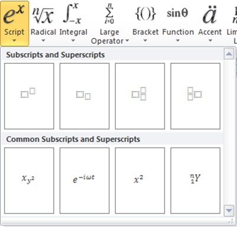

There is the Radical symbol set: 
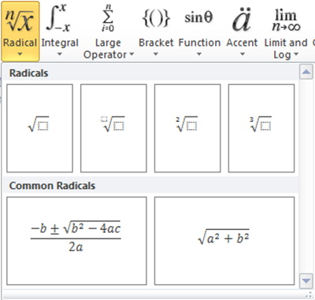

The Integral and Large Operator symbol sets are not generally used in PHYS1521 so are not shown here. The next important set is the Bracket symbol set: 
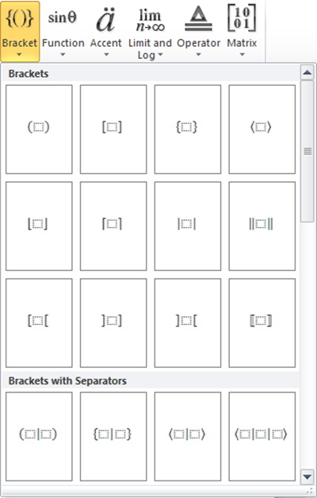

The Function symbol set is useful for Trigonometry: 
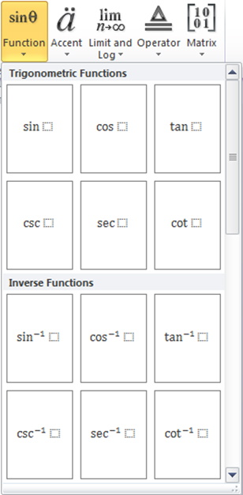

You may find that you need some symbols from the Accent symbol set: 
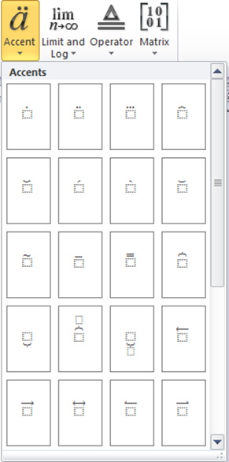

The Limit and Log, and Operator symbol sets are not normally used in PHYS1521 so are not shown here. The last symbol set shown on the editor is the Matrix symbol set: 
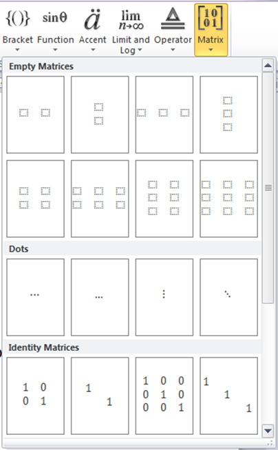

You should start out by trying to recreate a simple equation of a line: 
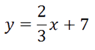

What symbols do you need?
* y
* =
* 2/3 (this is a fraction)
* x
* +
* 7

Try it?

Now that should not have been too difficult but then that was a simple equation. Try to recreate the next equation: 
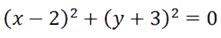

What symbols do you need?
* () - Parenthesis is in the Bracket symbol set
* x
* -
* 2
* 2 - the exponent 2; often referred to as a superscript
* y
* +
* 3
* =
* 0

This one is more complex as you need to break down 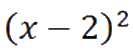 into separate symbols. Which symbol would come first? Start at the outside and you would first select the Script symbol set. This will give you .

Once there you can add the parenthesis and the exponent: 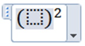

Next fill in the parenthesis with x – 2: 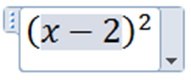

Repeat for the second part, do not forget the `+` symbol, and add the `= 0`.

The equations can be very complex so try to recreate the equation below: 
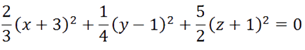

So far you have used parenthesis, exponents, and fractions, along with basic math symbols. In a more complex equation (shown below) you will see square roots and both super and subscripts, and a strange looking bracket: 
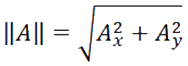

Refer to a previous part of this document (showing where some of the symbols are located) and see if you can recreate this equation.

Now that you have some of the basics you should also understand that you can format the text of an equation, color, font, etc., as shown in the equation below: 
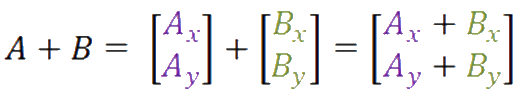

Formatting text does take additional time but does help in highlighting the steps involved in solving an equation. Try it for yourself.

## Limitations
The equations you create in Word 2010 are not backwardly compatible with previous versions of Word, nor are they generally compatible with other document processors. It is also very difficult to transfer the equations to a web page unless you embed the Word document as a file. There are some online Word compatible editors that will allow you to create equations but their compatibility with the desktop version of Word is not guaranteed.

How do you transfer your equations? One method is to use OneNote (the method used to create the images of the equations, and screenshots, used in this document). There are other tools, such as [Snagit from TechSmith](http://www.techsmith.com/snagit.html){:target="_blank"} that will also work.

If you have a little more cash to spend you could purchase a standalone equation editor such as [MathMagic](http://www.mathmagic.com/){:target="_blank"}.

### [PHYS1521 Home](index.md)