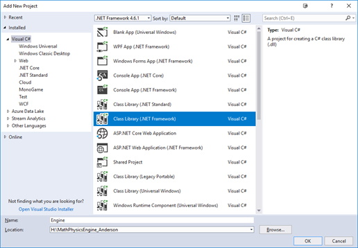
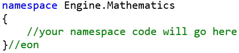
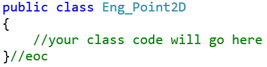
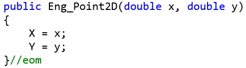
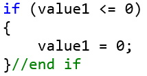
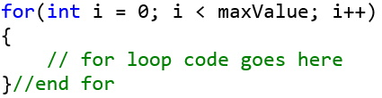
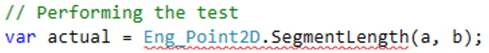
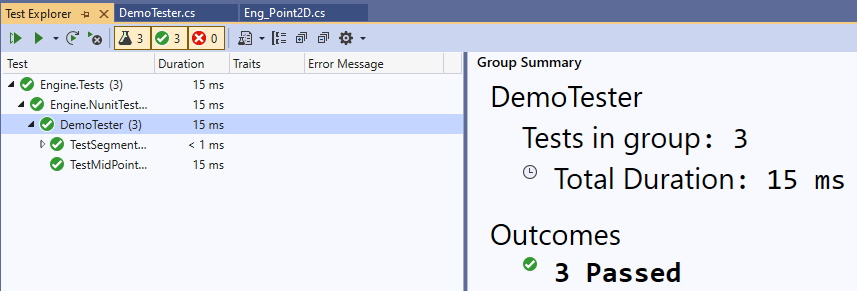

<style>
    .comments{
        color: green;
        font-weight: bold;
        font-family: Courier New
    }
</style>

The following file is required for this outcome:
* [PHYS1521 Engine Files](files/engine-files.zip)

## Lab Setup Instructions
1. Open Visual Studio and create a new Visual Studio Solution project: **MathPhysicsEngine_Lastname** (replace Lastname with your last name)
2.	Add a new project called **Engine**, which must be a Class Library (.NET Framework). Once created, delete the **Class1.cs** file.<br>

3.	In this project add the following folders:<br>
    <ol type="a">
        <li><b>Mathematics</b> (this will be used for all the coded math classes)</li>
        <li><b>Physics</b> (this will hold the code for physics classes)</li>
    </ol>
4.	Add another project called **Engine.Tests** (the same type of project as created for the Engine project) and delete the **Class1.cs** file.
5.	In this project add the following folders:<br>
    <ol type="a">
        <li><b>Demo</b> (this will for the in-class demo tests)</li>
        <li><b>Lab1</b> (this will for all Lab 1 tests)</li>
        <li><b>Lab2</b> (this will for all Lab 2 tests)</li>
        <li><b>Lab3</b> (this will for all Lab 3 tests)</li>
        <li><b>Lab4</b> (this will for all Lab 4 tests)</li>
    </ol>
6.	Download the PHYS1521 Engine Files (extract all the files if you downloaded the folder as a ZIP file).
7.	Add files to your Visual Studio solution:<br>
    <ol type="a">
        <li>Right-click the <b>Mathematics</b> folder of the <b>Engine</b> project and add an existing item. You will add the <code>Eng_Point2D.cs</code> class.</li>
        <li>Right-click the <b>Demo</b> folder of <b>Engine.Test</b> project and add an existing item. The item you will add is <code>DemoTester.cs</code> (you will have an error which will be fixed later).</li>
    </ol>
8.	Right-click the **Engine.Test** project and select **Add --> Reference**. Select the **Engine** project.
9.	Right-click your Solution (**MathPhysicsEngine_Lastname**) and select **Manage NuGet Packages for Solution…**.
10.	Select Browse, and search for **NUnit**. Add the **NUnit** and **NUnit3TestAdapter** packages to the **Engine.Test** project only.
11.	Modify the following methods in the `Eng_Point2D.cs` class to be:<br>

```csharp
#region Class Methods
public double SegmentLength(Eng_Point2D a, Eng_Point2D b)
{
    return Math.Sqrt(Math.Pow(b.x - a.x, 2) + Math.Pow(b.y - a.y, 2));
}//eom

public static Eng_Point2D MidPoint(Eng_Point2D a, Eng_Point2D b)
{
    return new Eng_Point2D(0.5 * (a.x + b.x), 0.5 * (a.y + b.y));
}//eom
#endregion

#region Overload Operators
#region Complier Warning Fix
// the following two methods are to remove the CS0660 and CS0661 compiler warnings
public override bool Equals(object obj)
{
    return true;
}//eom

public override int GetHashCode()
{
    return 0;
}//eom
#endregion

// the == and != must both be coded or you get a compile error
public static bool operator ==(Eng_Point2D a, Eng_Point2D b)
{
    return a.x == b.x && a.y == b.y;
}//eom

public static bool operator !=(Eng_Point2D a, Eng_Point2D b)
{
    return a.x != b.x || a.y != b.y;
}//eom

public static Eng_Point2D operator *(double s, Eng_Point2D p)
{
    return new Eng_Point2D(s * p.x, s * p.y);
}//eom
#endregion
```

12.	Modify the following methods in the DemoTester.cs class to be:<br>

```csharp
public void TestSegmentLengthPoint2D(double aX, double aY, double bX, double bY, double expected)
{
    // Create Objects for the test
    Eng_Point2D a = new Eng_Point2D(aX, aY);
    Eng_Point2D b = new Eng_Point2D(bX, bY);
    // Performing the test
    var actual = a.SegmentLength(a, b);
    Assert.AreEqual(expected, actual);
}//eom

public void TestMidpointPoint2D(Eng_Point2D a, Eng_Point2D b, Eng_Point2D expected)
{
    // Performing the test (no setup required)
    Eng_Point2D actual = Eng_Point2D.MidPoint(a, b);
    // Assert - did we get back the correct answer
    Assert.AreEqual(expected.x, actual.x);
    Assert.AreEqual(expected.y, actual.y);
}//eom
```

13.	**BUILD** your solution; should build successfully.
14.	**TEST** by selecting **Test --> Run --> All tests** from the main Visual Studio menu.

## Coding
Open the `Eng_Point2D.cs` file. This file demonstrates the basic coding practice to use for all the class files for the PHYS1521 labs.

### Properties
Each class will have public properties with `{ get; set; }`.

### Constructors
Each class will have an empty constructor, and one or more greedy constructors. The simplest greedy constructor will contain a parameter for each of the properties of the class. Other greedy constructors may be required.

### Class Methods
Each class will contain one or more class methods. The class methods will perform mathematical operations using the properties of the class to either:

<ol type="a">
    <li>Modify the instance of the class</li>
    <li>Return a calculated value based on one or more of the properties of the class</li>
</ol>

### Overload Operators
The overload operators perform mathematical operations, and Boolean comparisons, on one or more instances of the class. Using an overloaded operator makes the class more functional, and saves having to write other more complex classes.

## Provided Class Code
For many of the classes needed for a PHYS1521 Lab, you will be given starting code. This will aid you in completing the labs.

## Provided Test Code
For each lab, there will be a test class created. The starting test class provided is incomplete. You will need to either:<br>
* Leave the test data alone (i.e., <span class="comments">// Instructor Data - MUST NOT DELETE OR MODIFY</span>)
* Leave the test data alone (i.e., <span class="comments">// Student Data - YOU NEED TO ADD YOUR DATA BELOW</span>)
* Leave the test data alone (i.e., <span class="comments">// Student Data - MUST CHANGE</span>)

The test methods provided are mostly incomplete; they should all pass because they do not test anything. You will need to code the test to test the constructors, class methods, and overload operators of the class. Some of test cases provided are complete, or need no modifications; DO NOT change that code.

## Eng_Point2D.cs
Examine the code in this class file. Does it have all the required components?
### Properties
A point in 2D coordinate space is denoted by `(x,y)`, therefore the two properties.

```csharp
// Properties
public double X { get; set; }
public double Y { get; set; }
```

### Constructors
Note this class has both the empty constructor and the greedy constructor.

```csharp
// Empty Constructor
public Eng_Point2D()
{
    X = 0;
    Y = 0;
}//eom

// Greedy Constructor
public Eng_Point2D(double x, double y)
{
    X = x;
    Y = y;
}//eom
```

### Class Methods
In this class, there two methods, one for calculating the length of a line segment between two Eng_Point2D objects, and a method to calculate the midpoint between two Eng_Point2D objects:

```csharp
#region Class Methods
public double SegmentLength(Eng_Point2D a, Eng_Point2D b)
{
    return Math.Sqrt(Math.Pow(b.x - a.x, 2) + Math.Pow(b.y - a.y, 2));
}//eom

public static Eng_Point2D MidPoint(Eng_Point2D a, Eng_Point2D b)
{
    return new Eng_Point2D(0.5 * (a.x + b.x), 0.5 * (a.y + b.y));
}//eom
#endregion
```

### Overload Operators
In the **Overload Operators**region, there is the following code:

```csharp
#region Complier Warning Fix
// the following two methods are to remove the CS0660 and CS0661 compiler warnings
public override bool Equals(object obj)
{
    return true;
}//eom
public override int GetHashCode()
{
    return 0;
}//eom
#endregion
```

This code is there to avoid complier warnings for equality (`==`) and inequality (`!=`).

This section also contains overload operators for equality and inequality. Note that both methods MUST be coded as a matching pair or you will get a compile error:

```csharp
// the == and != must both be coded or you get a compile error
public static bool operator ==(Eng_Point2D a, Eng_Point2D b)
{
    return a.X == b.X && a.Y == b.Y;
}//eom

public static bool operator !=(Eng_Point2D a, Eng_Point2D b)
{
    return a.X != b.X || a.Y != b.Y;
}//eom
```

There is one additional overload operator, which overrides the multiplication operator:

```csharp
public static Eng_Point2D operator *(double s, Eng_Point2D p)
{
    return new Eng_Point2D(s * p.X, s * p.Y);
}//eom
```

## Coding Practices
### Comments
You will notice that there are comments after the `}` symbols. These are not strictly required, but using the comments will be valuable in working with large code files. The general comments that should be used are outlined in the table below.

**Comment** | **Meaning** | **Example**
------------|-------------|------------
<span class="comments">//eon</span> | The end of the namespace | 
<span class="comments">//eoc</span> | The end of the class | 
<span class="comments">//eom</span> | The end of the method | 
<span class="comments">//end if</span> | Used when you have an<br>`if-then `,<br>or an `if-then-else` | 
<span class="comments">//end for</span> | Used when you have a for-next loop | 

### Static vs. Non-static Methods
In the Eng_Point2D class, the class methods were both `static` methods. Using a static method allows you to treat the method like a property of the class. For example, the method to calculate the segment length, and the associated test in the DemoTester:

```csharp
public static double SegmentLength(Eng_Point2D a, Eng_Point2D b)
{
    return Math.Sqrt(Math.Pow(b.X - a.X, 2) + Math.Pow(b.Y - a.Y, 2));
}//eom

public void TestSegmentLengthPoint2D(double aX, double aY, double bX, double bY, double expected)
{
    // Create Objects for the test
    Eng_Point2D a = new Eng_Point2D(aX, aY);
    Eng_Point2D b = new Eng_Point2D(bX, bY);
    // Performing the test
    var actual = Eng_Point2D.SegmentLength(a, b);
    Assert.AreEqual(expected, actual);
}//eom
```

**Question**: Do you see the correlation between callint the `SegmentLength` method and the method signature for `SegmentLength`?

If we make the SegmentLength method `non-static` the code for the method would be:

```csharp
public double SegmentLength(Eng_Point2D a, Eng_Point2D b)
{
    return Math.Sqrt(Math.Pow(b.X - a.X, 2) + Math.Pow(b.Y - a.Y, 2));
}//eom
```

The problem now is there is a compile error in the DemoTester:<br>
<br>
To fix this, the **TestSegmentLengthPoint2D** code would need to be:

```csharp
public void TestSegmentLengthPoint2D(double aX, double aY, double bX, double bY, double expected)
{
    // Create Objects for the test
    Eng_Point2D a = new Eng_Point2D(aX, aY);
    Eng_Point2D b = new Eng_Point2D(bX, bY);
    // Performing the test
    var actual = a.SegmentLength(a, b);
    Assert.AreEqual(expected, actual);
}//eom
```

**Question**: Do you see the coding difference?

The compile error is gone, and the test still passes:<br>


There could be one further refinement to both the SegmentLength method and **TestSegmentLengthPoint2D**.

```csharp
public double SegmentLength(Eng_Point2D b)
{
    return Math.Sqrt(Math.Pow(b.X - X, 2) + Math.Pow(b.Y - Y, 2));
}//eom

public void TestSegmentLengthPoint2D(double aX, double aY, double bX, double bY, double expected)
{
    // Create Objects for the test
    Eng_Point2D a = new Eng_Point2D(aX, aY);
    Eng_Point2D b = new Eng_Point2D(bX, bY);
    // Performing the test
    var actual = a.SegmentLength(b);
    Assert.AreEqual(expected, actual);
}//eom
```

With this change the TestSegmentLengthPoint2D still passes the testing:<br>


Which version is better? If you are modifying a class, and not using an overload operator, then you cannot make your method static; all overload operator methods must be static methods.

## Coding Conventions & Standards
When coding your labs, you **MUST** adhere to the following conventions and standards:
1.	All properties begin with an uppercase letter and must be PascalCased if the property name is a concatenation of two or more words.
2.	All properties will need a `{ get; set; }`
3.	Constructors **MUST** set all the public properties of a class to valid values.
4.	Empty constructors **MUST** explicitly set property values, even if the value is 0.
5.	Constructors **NEVER** return a value.
6.	Class methods **DO NOT** (normally) take in external parameters.
7.	**DO NOT** modify method code signature given for lab questions; just code the body of the method.

