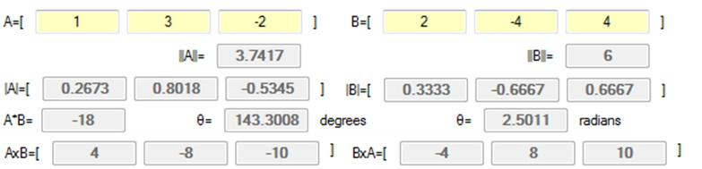
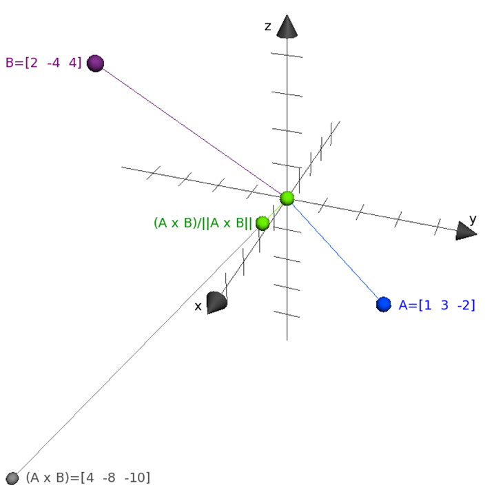
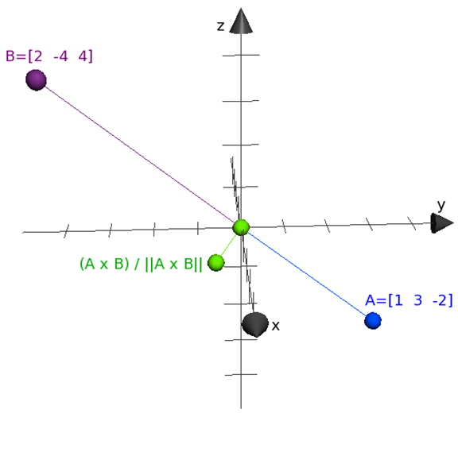
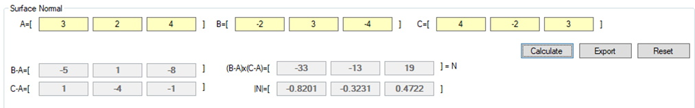
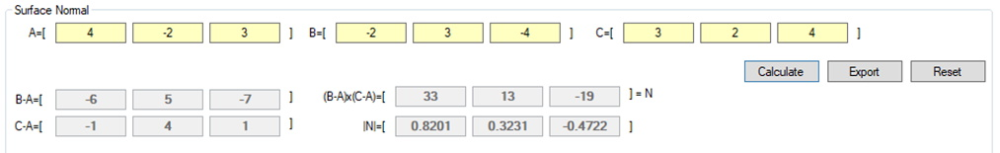

## Introduction
The other key vector concept is that of the Cross Product. The Cross Product differs from the Dot Product, whose result is a scalar, in that it produces another 3D vector. There is NO Cross Product for 2D vectors.

## Cross Product
### Key Concepts
The key concepts for this part of the lesson are:
* Computing a Cross Product
* Computing the Surface Normal

### Lesson
As stated in the previous lesson, the multiplication of vectors is different from multiplying scalar values. For example, we know that:

However, the other symbol for multiplication, `x`, produces a different result:

Looking at this result the computation is not obvious.

With  then 

Next  then 

Finally  then 

Therefore we get 

Using our intial example we get:

It is best if another example is used. This example also has a graphical representation in, 3D, of the Cross Product.

Given the 3D vectors of  and  we can calculate the Cross Product as:

 
 

The first graphical view shows a vector that is perpendicular to A and B, which is the result of the Cross Product, and shows a vector , this vector is sometimes called the Surface Normal. The second graphical view shows, as best that can be done, that the **normalized** Cross Product is perpendicular to both A and B.

The concept of a **normalized** vector was previously covered. It is an important concept that students need to know. A **normalized** vector has a magnitude of 1. It is computed by dividing each vector component by the magnitude of the vector.

Geometrically it can be shown that:

This result is equal to the area of the parallelogram formed by the two sides A and B.

The true meaning of a **Surface Normal** depends on the type of surface. The simplest type of surface is one formed by three points in 3D coordinate space. To find the surface normal of the plane formed by these three points, use the following steps:
1.	Choose one point as a reference point.
2.	Determine the vectors from the reference point to the other two points that determine the plane.
3.	Calculate the Cross Product of the vectors from step 2.
4.	Normalize the calculation from step 3.

### Example
Given three points , , and , calculate the surface normal.

Using **A** as the reference point, the vectors  and  are calculated as follows:

Next calculate  (the Cross product):

Finally, normalize the Cross Product:

As we can choose any of the three points as a reference point, selecting a different point as a reference point will give a different resulting Surface Normal (A and C swapped; C is the reference point):

## Exercises & Assignments
Complete the [Vector Exercises Part 3](vector-worksheet-3.md) worksheet. Once complete proceed to Moodle to complete Knowledge Check 04 - Vectors Pt. 3 (Cross Product) (strongly recommended to be completed prior to attempting Lab 1).

#### [Outcome Home](index.md)
#### [PHYS1521 Home](../)