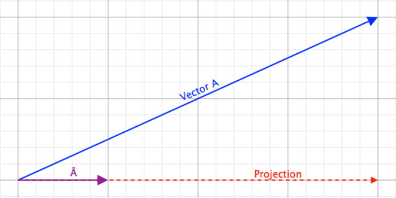
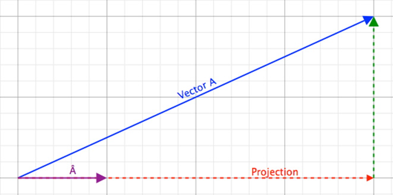

## Introduction
There are certain mathematical concepts with vectors that are key. One such concept is that of the Dot Product. In math classes you were introduced, initially, to expressions like 2 × 3 = 6. Later on the teacher(s) probably wrote this as 2 ∙ 3 = 6. For pure numbers, or scalar values, both of these expressions are valid, but this is not true for vectors.

## Dot Product
### Key Concepts
The key concepts for this part of the lesson are:
* Computing a Dot Product
* Application of the Dot Product, i.e., projections and angle between two vectors

### Lesson
As stated in the introduction, the multiplication of vectors is different from multiplying scalar values. For example:

The actual calculation is pretty straight forward:

This also works for 3D vectors: . Such a simple calculation but it is important to note that the Dot Product produces a scalar value. The question is what does this scalar value represent?

The figure above shows a projection of Vector A onto a unit vector on a line parallel to the Projection of A creating a “shadow” or a Projection of A. The Projection is shown with an arrow but the Dot Product is a scalar value so this representation is purely to show a relative direction of the Dot Product. Therefore:

In this case the Dot Product  results in a positive number, but this is not always the case. This Dot Product can be positive, zero, or negative, depending on the actual value of the Vector. This still does not give a full explanation of what the Dot Product is useful for, but is key for the next step. 

Using the figure above and change the unit vector to a vector of any length it should be relatively easy to compute the angle between the two vectors:

This equation is only partially complete. The correct form is (derived using the Law of Cosines):

Example, given two vectors,  and , calculate the Dot Product of the vectors and the angle between them:

### [Outcome Home](outcome1.md)
### [PHYS1521 Home](../)