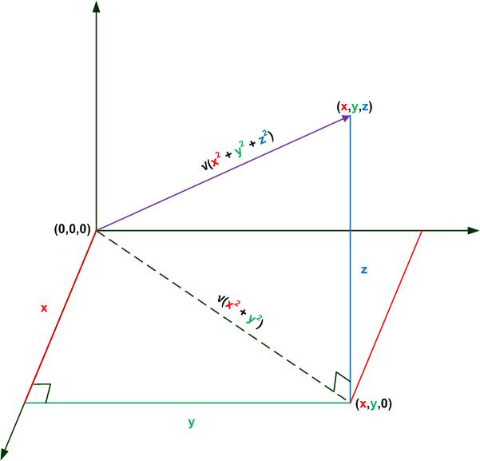

## Introduction
In algebra you are aware of the **Quadratic Formula**  and the solution equation 

## Pythaogream Theorem in 3D Space
The proof that you can use the Pythagorean Theorem in 3D space is illustrated in the figure below.

Using just the x and y axis, the hypotenuse of the triangle, which forms the base of the triangle with the z-axis, is: 

Therefore, to find the hpotenuse of the triangle to the z-axis we get: 

## Exercises & Assignments
There are no exercises or assignments associated with this addendum.

#### [Outcome Home](index.md)
#### [PHYS1521 Home](../)
