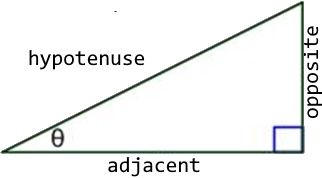

For all questions use the basic right triangle as shown below: 

1. Given θ = 20o and hypotenuse = 4, then adjacent = **??** and opposite= **??**.
2.	Given θ = 40o and hypotenuse = 6, then adjacent = **??** and opposite = **??**.
3.	Given θ = 20o and opposite = 4, then hypotenuse = **??** and adjacent = **??**.
4.	Given θ = 40o and opposite = 4, then hypotenuse = **??** and adjacent = **??**.
5.	Given θ = 20o and adjacent = 4, then hypotenuse = **??** and opposite = **??**.
6.	Given θ = 40o and adjacent = 4, then hypotenuse = **??** and opposite = **??**.
7.	Given adjacent = 5 and opposite = 3 then hypotenuse = **??** and θ = **??**o.
8.	Given adjacent = 3 and opposite = 5 then hypotenuse = **??** and θ = **??**o.
9.	Given adjacent = 6 and opposite = 2 then hypotenuse = **??** and θ = **??**o.
10.	Given adjacent = 2 and opposite = 6 then hypotenuse = **??** and θ = **??**o.
11.	Given adjacent = 2 and hypotenuse = 5 then opposite = **??** and θ = **??**o.
12.	Given adjacent = 2 and hypotenuse = 6 then opposite = **??** and θ = **??**o.
13.	Given adjacent = 4 and hypotenuse = 5 then opposite = **??** and θ = **??**o.
14.	Given adjacent = 4 and hypotenuse = 6 then opposite = **??** and θ = **??**o.

### [Lesson Home](trigonometry.md)
### [Outcome Home](index.md)
### [PHYS1521 Home](../)
