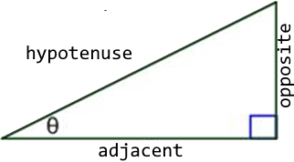

## Introduction
Most students should know the basic 2D Cartesian coordinate system, and have a good knowledge of the 3D coordinate system. This lesson will clarify these concepts and how they relate to game programming, and it will be a foundation for the remainder of the course.

## 2D Coordinate Space
### Key Concepts
The key concepts for this part of the lesson are:
* The 2D coordinate system is arbitrary
* There is usually a difference between the 2D system learned in previous math classes and that used in 2D game engines
* In class students will use the standard 2D system as taught in previous math classes

### Lesson
When viewing a scene of a game each object displayed is displayed relative to the game camera, and such is how our 2D system must be; everything is relative. As a 2D system is relative how can game programmers work in such a system? The answer is simple as we treat each game interaction as its own 2D system and do the math accordingly.

There are two 2D systems, one which is the standard 2D system that will be used in class and the other being the 2D system used in some game engines (the point `[0,0]` is at the top left of the screen). How can game programmers work with the second coordinate system? The answer is a simple math translation. (The transformations/rotations used will be covered in a future lesson, but the students should get the concept that there is a standard 2D coordinate system.)

## 3D Coordinate Space
### Key Concepts
The key concepts for this part of the lesson are:
* The 3D coordinate system has similarities and differences from the 2D coordinate system
* There are two fundamental representations of a 3D coordinate system (Left Hand Rule and Right Hand Rule)

### Left & Right Hand Rules
Students need to know that there are two basic graphics display systems used in game engines with each using one of the two standard representations. The **Left Hand Rule** uses a clockwise rotation, while the **Right Hand Rule** uses a counterclockwise rotation.

_For the remainder of the class lessons the **Left Hand Rule** will be used, which has a z-axis heading._

## Trigonometry
### Key Concepts
The key concepts for this part of the lesson are:
* Conversion between degrees and radians
* Solving a right triangle
* Understanding some basic trigonometric identities

### Lesson
The right triangle: 

You should remember **SOH CAH TOA** from high scholl math class: 
&nbsp;&nbsp;

These simple trig equations can be algebraically rearranged:
#### Sine Function
&nbsp;<b>AND</b>&nbsp;

#### Cosine Function
&nbsp;<b>AND</b>&nbsp;

#### Tangent Function
&nbsp;<b>AND</b>&nbsp;

You should also remember the Pythagorean Theorem: 
&nbsp;<b>OR</b>&nbsp;

At this point it is important to do some sample calculations with a specific focus on finding the side opposite and side adjacent given θ and the hypotenuse, and the reverse of this calculation.

When doing these calculation is previous math classes most students used `degrees` for the measurement of the angle θ. In computer programming the standard math libraries for these calculations use `radians`. The simplest way to explain this concept is to ask for the equation for the circumference of a circle (). Knowing that there are 360o in a circle we get: 

Therefore,  and .

## Exercises & Assignments
Complete the [Trigonometry worksheet](trig-worksheet.md). Once complete proceed to Moodle to complete Knowledge Check 01 - Trigonometry (strongly recommended to be completed prior to attempting Lab 1).

### [Outcome Home](outcome1.md)
### [PHYS1521 Home](../)
