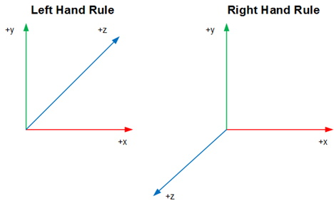

## Introduction
Most students should know the basic 2D Cartesian coordinate system, and have a good knowledge of the 3D coordinate system. This lesson will clarify these concepts and how they relate to game programming, and it will be a foundation for the remainder of the course.

## 2D Coordinate Space
### Key Concepts
The key concepts for this part of the lesson are:
* The 2D coordinate system is arbitrary
* There is usually a difference between the 2D system learned in previous math classes and that used in 2D game engines
* In class students will use the standard 2D system as taught in previous math classes

### Lesson
When viewing a scene of a game each object displayed is displayed relative to the game camera, and such is how our 2D system must be; everything is relative. As a 2D system is relative how can game programmers work in such a system? The answer is simple as we treat each game interaction as its own 2D system and do the math accordingly.

There are two 2D systems, one which is the standard 2D system that will be used in class and the other being the 2D system used in some game engines (the point `[0,0]` is at the top left of the screen. How can game programmers work with the second coordinate system? The answer from the class should be something like a simple translation. (The transformations/rotations used will be covered in a future lesson, but the students should get the concept that there is a standard 2D coordinate system.)

## 3D Coordinate Space
### Key Concepts
The key concepts for this part of the lesson are:
* The 3D coordinate system has similarities and differences from the 2D coordinate system
* There are two fundamental representations of a 3D coordinate system (Left Hand Rule and Right Hand Rule)

### Left & Right Hand Rules
Students need to know that there are two basic graphics display systems used in game engines with each using one of the two standard representations. The **Left Hand Rule** uses a clockwise rotation, while the **Right Hand Rule** uses a counterclockwise rotation.

_For the remainder of the class lessons the **Left Hand Rule** will be used, which has a z-axis heading._

### Lesson

### [Outcome Home](outcome1.md)
### [PHYS1521 Home](../)