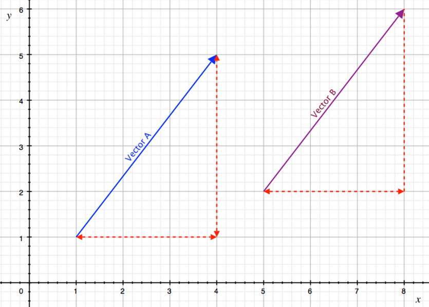

## Introduction
Most of the work done in game programming, and thus in this course, is done using vectors. Some students may know some basics of what a vector is and how to represent it. 

## Representation of a Vector
### Key Concepts
The key concepts for this part of the lesson are:
* The mathematical representation of a vector
* The geometric representation of a vector
* Addition & subtraction of vectors
* Scaling a vector
* Magnitude and distance equations

## Lesson
### Representation
A vector is a mathematical number that has both `magnitude` and `direction` and as such there needs to be a way of representing a vector; mathematically for computations, and geometrically to support the mathematical computations.
Additionally, like basic numbers (scalar values), mathematical operations should be able to be performed on them.

As this course is for game programming the fundamental representation of a vector will be mathematical. There are two forms, as shown below, which represent the same vector:

&nbsp;(Horizontal or row form, [seen on Knowledge Chechs])

&nbsp;(Vertical or column form [used in this course])

The form used depends does not matter unless multiplying a matrix by a vector (future lesson) and as such both forms will be used interchangeably (the row form will be used on Moodle Knowledge Checks).

There is a loose relationship between a vector and point in either a 2D or 3D coordinate system. Typically, a vector is in the form:

&nbsp;<b>OR</b>

As either of these forms can be used it would make sense that a vector can be represented graphically using a 2D or 3D coordinate system. It is important to note here that the location of a vector in either a 2D or 3D coordinate system is purely arbitrary; that is the same vector can be drawn graphically in different locations on a coordinate system but still be the same vector.

#### Example

It is now important to emphasize that the x and y components of a vector do not represent actual distances from the origin of a 2D coordinate system (recall that the 2D coordinate system is itself a relative representation) but a change in x and y component directions; we can place a vector anywhere on a 2D coordinate system and it would still represent the actual vector.

### Addition & Subtraction
How would you answer the following example:

Given &nbsp;and &nbsp; what is A + B? 

What about A - B? 

It is important that students understand the result is simply the addition, or subtraction, of individual vector components. Mathematically  and .

### Scaling
In mathematics you learned that  (and other multiplication facts). Does the following make sense:

This is mathematically identical to:

This can be shown graphically as well if needed to reinforce this concept. The main concept is that and vector can be multiplied by a scalar value to produce a new vector.

### Magnitude & Direction
Using the vectors from the graphical representation, calculate the magnitude of the vectors. The answer should be 5 by using the Pythagorean Theorem:

The proper way to represent this is 

We know that a vector has both magnitude and direction. The direction of a vector can be found using basic trigonometry:

Calculate the direction of the following vectors:

<ol type="a">
    <li>  </li>
    <li>  </li>
    <li></li>
</ol>

_The direction for A is the same as the original vector example but the direction of the x and y values are opposite. The directions for both B and C are the same but graphically they are not. What is the problem?_

The tan-1 function does not distinguish between quadrants of a 2D coordinate system. In programming there are two functions that can be used `atan` and `atan2`. Using `atan` will give you the wrong result when the vector is in an opposite quadrant, while the `atan2` function should give you the correct angle value.

With the calculations the vector can be written as: 
`magnitude@direction`

For the majority of this course you will not have to convert from the component form to the magnitude and direction (polar) form but be aware of the issues. Most of the work will have vectors in component form with some conversion from polar to component form.

Given a vector 20@30o convert this to component form.

Up to this point the number of decimal places used has not been specified (answers shown were from the computer’s calculator application and no rounding was used). Refer to [Notation Statndards](../notation-standards.md) for use of decimal places.

## Exercises & Assignments
Have students complete the [Vector Exercises Part 1 worksheet](vector-worksheet-1.md). Once complete proceed to Moodle to complete Knowledge Check 02 - Vectors Pt. 1 (Conversion) (strongly recommended to be completed prior to attempting Lab 1).

### [Outcome Home](outcome1.md)
### [PHYS1521 Home](../)