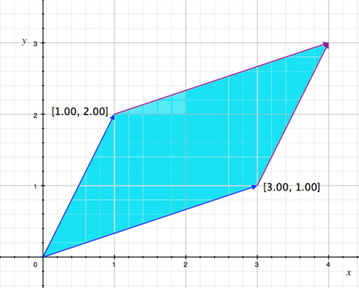
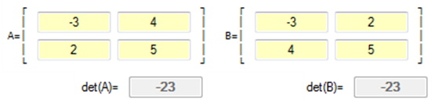
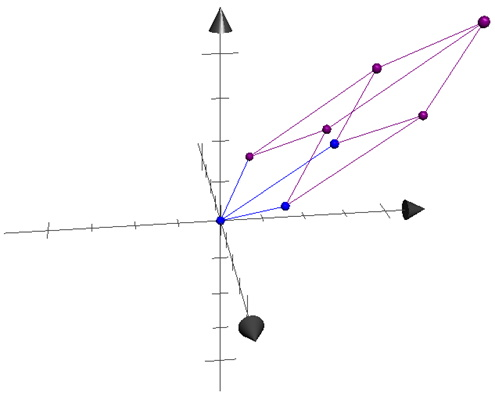
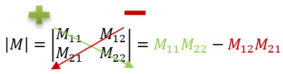
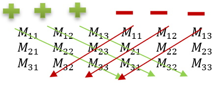
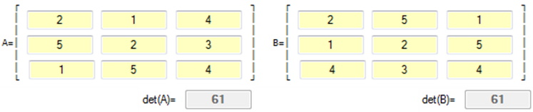
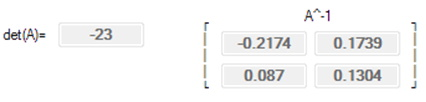

## Introduction
Previously the work with matrices has been multiplication, scaling, and linear transformations. With linear transformations, it was found that an object could be moved, and scaled in 2D and 3D space. This lesson will focus on getting the object back to its original position.

## Determinants
### Key Concepts
The key concepts for this part of the lesson are:
* Definition of a determinant
* Calculating a determinant for a 2x2, 3x3, and 4x4 matrices

## Lesson
Every square matrix has a special property called the determinant. The determinant is used to create an inverse matrix from a given matrix such that . Not every square matrix has an inverse, as will be covered later in this lesson, but for now that is the purpose of covering determinants. It is important to get an understanding of what a determinant is before it is calculated.

#### 2x2 Determinants
Given the matrix:

The matrix can be graphically represented by plotting its basis vectors and creating a parallelogram with the determinant of the matrix equal to the area of the parallelogram:

Now that a determinant of a 2x2 matrix can be shown graphically the next step is to compute the determinant mathematically. The determinant of **M** is written as  or  (note this symbol is not the absolute value).

The computed value of a determinant is not always a positive number; it can be negative or even zero. For example, given the matrix below:

#### 3x3 Determinants
Now what about a 3x3 matrix? Since a 3D matrix has 3 basis vectors the geometric shape would be a parallelogram extended to 3 dimensions creating a parallelepiped. In this case the determinant would be the volume of the parallelepiped as shown in the below:

Note in figure above that each side of the parallelepiped is ”extruded” from the plane created by only two of the matrix basis vectors, thus creating the 3D shape. The matrix used for this figure is show below:

Now that a determinant of a 3x3 matrix can be shown graphically the next step is to compute the determinant mathematically. Starting with what is known about the determinant of a 2x2 matrix a pattern can be created: 

The pattern is the diagonals from left to right are **+** and the diagonals from right to left are **-**. To do this math the 3x3 matrix needs to be duplicated and the duplicate written beside it as shown below: 

This results in the equation:

Now using the 3D matrix, the calculation of its determinant is:

This method of calculating the determinant of a 3x3 matrix does not extend to the calculation of the determinant of a 4x4 matrix. The correct process uses determinants of 2x2 matrices:

Given 

then

Expanding this out we get:

Comparing this result with the previous result shows the answer will be the same. Unfortunately, the calculation of the determinant of a 4x4 matrix MUST use this proper method (above), and not expanding on the original 3x3 determinant calculation.

#### 4x4 Determinants
If we use the pattern from the 3x3 determinant calculation, you will NOT get the correct determinant value. Instead, you need to use the following pattern:

Given matrix 

then

 

## Inverses
### Key Concepts
The key concepts for this part of the lesson are:
* Create an inverse matrix for 2x2 and 3x3 matrices
* Prove that the inverse matrix satisfies the equation 

### Lesson
Previously it was given that the inverse of a matrix satisfies the equation . For a 2x2 matrix the inverse is calculated as:

 where 

Example using the previous 2x2 matrices:

For 3x3, and 4x4 matrices, the method used to calculate the inverse is called the Adjoint method. The creation of an Adjoint Matrix involves creating a new matrix which is made up of cofactors, calculating the determinant of each cofactor matrix, then transposing the matrix. Lastly the inverse of a matrix is computed as:

As this equation involves dividing each element of the Adjoint Matrix by a determinant, if the determinant is zero the given matrix has no computable inverse.

In the previous example the determinant was computed to be 61:

which is not zero, therefore the inverse of the given matrix can be computed.

Each of the elements of the `adjoint` array are called `cofactors`.

To find a cofactor matrix, such as  do the following:
* Eliminate the first row and the first column on the matrix
* Calculate the determiniant of the resulting 2x2 matrix:

To find a cofactor matrix, such as  do the following:
* Eliminate the first row and the second column on the matrix
* Calculate the determiniant of the resulting 2x2 matrix multiplied by -1:

