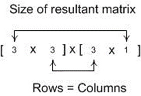
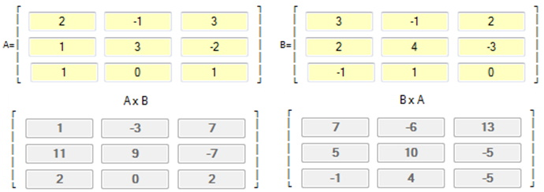
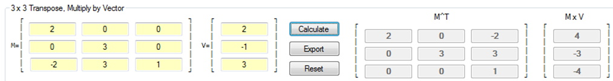

## Introduction
Along with Vectors, Matrices form the foundation of the math used by game engines. In Algebra matrices are taught so that students can solve a system of linear equations. In game programming matrices are used for transformation of objects (shifting, scaling, shearing, and rotation) in 2D and 3D coordinate spaces. Before the transformation topics can be covered an understanding, or review, of matrices is required.

## References
* [Matrix Tutorial](http://www.opengl-tutorial.org/beginners-tutorials/tutorial-3-matrices/#Translation_matrices){:target="_blank"}
* [Transforms (Direct3D 9)](https://msdn.microsoft.com/en-us/library/windows/desktop/bb206269%28v=vs.85%29.aspx){:target="_blank"}

## Definition and Notation
### Key Concepts
The key concepts for this part of the lesson are:
* Matrix definition
* Matrix dimensions
* Row vs. Column matrices
* Vectors as matrices

### Lesson
What is a matrix is and what it is used for? A matrix is defined as a mathematical entity with rows and columns that represent a set of data. With this definition, a matrix could be defined as something like 4x3 which is read to be 4 rows with each row having 3 columns. An example of such a matrix is shown below (note the use of square brackets, which is like that used with vectors):

Typically, like vectors, the identifier of a matrix will be a capital letter. To access individual elements of the matrix we use subscripts such as shown below:

Where an element such as **M12** is read as **m one two**. This notation is 1-based, and this example shows the matrix that has the same number of rows as the number of columns, thus it is a square matrix.

There is one special square matrix, called the **Identity Matrix** that always has the value of 1 on each element of its diagonal as shown in the example below:

As a matrix can have 1 to many rows, with 1 to many columns it is reasonable to create a 1x3 or a 3x1 matrix as shown below:

&nbsp;<b>OR</b>&nbsp;

Both forms look very, very similar to that of a vector; the first could be a row vector, while the second could be a column vector with each “representing” the same vector. Previously it did not matter which form of vector was used but when representing a vector as a matrix the form becomes very important.

## Matrix Math
### Key Concepts
The key concepts for this part of the lesson are:
* Matrix transposition
* Multiplying a matrix by a scalar
* Multiplying two matrices
* Multiplying a vector and a matrix

### Lesson
There are a couple of basic math concepts that will not be formally covered but should be intuitively easy and they are addition and subtraction of matrices. The math is very like that of adding and subtracting vectors. These concepts do not have to be formally covered as they are generally never used with matrices in game programming. The concepts outlined in the Key Concepts are those that pertain to game programming.

#### Transposition
Transposition is the flipping of a matrix on its diagonal. For example, a 4x3 matrix when transposed becomes a 3x4 matrix. The example below illustrates this:

&nbsp;<em>then</em>&nbsp;

Note how a row in A becomes a column in AT and vice versa. Most matrices in game programming are square matrices, either 2x2, 3x3, or 4x4, so use the following example:

&nbsp;<em>then</em>&nbsp;

Note that the values on the diagonal do not change during transposition. It is also possible to transpose a vector. Such a transposition will change a row vector into a column vector and vice versa.

&nbsp;<em>then</em>&nbsp;

Once again, the form of the vector used will become important later.

#### Multiplying a matrix by a Scalar
This concept is like that of scaling a vector. The following example should easily illustrate this:

Note that each element of the matrix is multiplied by the _scalar_ value and the result is a matrix of the same size as the original.

#### Multiplying two Matrices
Two matrices can only be multiplied together if the number of columns in the first matrix is equal to the number of rows in the second matrix. The resulting matrix has the size of the number of rows in the first matrix and the number of columns of the second matrix. 

It is easier to explain using the following algebraic example:

  

One may or may not see the pattern, so it is best to go through a couple of examples with actual values in the matrices, such as:

  
  

What about B × A? Have the students work through B × A to get: 

The concept that &nbsp;is a general rule. However, what if A is multiplied by the Identity Matrix, I? In this case,&nbsp;and &nbsp;, therefore .

#### Multiplying a Vector and a Matrix
At this point it becomes vitally important to know whether the game engine uses row or column vectors, or row vs. column matrices as the order of multiplication matters. Recall the basic rule for multiplying matrices in that the columns in the first matrix must match the rows in the second matrix. So, for a 3x3 matrix the following multiplications are allowed with vectors:

  

AND (**preferred for this course**): 

Examining the terms, it should be obvious that the resulting vector matrices from each example will give different results. To see this in action use the following example:

  
  

WHILE

With the results of multiplying a vector and a matrix being different when using a row vs. a column vector this begs the question as to which vector form is the correct form when doing these calculations? Many internet references prefer row vectors and go through a good discussion as to why row vectors are preferred over column vectors.

Using the example above, using a column vector and a transposed matrix the result will be the same vector as using the column vector and the original matrix:

It is important to note that graphics APIs use different; DirectX uses row vectors, while OpenGL uses column vectors. The DirectX documentation for matrix transformations (transformations will be covered in the next lesson) defines the Transformation as:

While the OpenGL Transformation matrix is defined as:

With the covering of transposing of a matrix it should be obvious that the transpose of the DirectX Transformation matrix will be the Transformation matrix of the OpenGL API.

With this knowledge, it should be noted that multiplication of a vector and a matrix in either system will give the same resulting vector based on the rules of matrix multiplication.

## Exercises & Assignments
Have students complete the [Matrix Math worksheet](matrix-worksheet-1.md). Once complete proceed to Moodle to complete Knowledge Check 05 - Matrix Math (strongly recommended to be completed prior to attempting Lab 2).

#### [Outcome Home](index.md)
#### [PHYS1521 Home](../)
