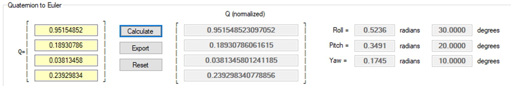
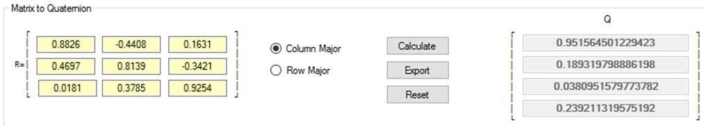

## Introduction
Previously the rotations in 3D used Euler angles. Although this approach works there are other methods of storing rotation information. One such technique is using a Quaternion; another is using Rotors which are not covered in this course.

## Reference
* [Maths - Conversion Quaternion to Euler](http://www.euclideanspace.com/maths/geometry/rotations/conversions/quaternionToEuler/index.htm){:target="_blank"}

## Quaternions
### Key Concepts
The key concepts of this part of the lesson are:
* Define what a Quaternion is and the pros and cons vs. Euler Angles
* Create a Quaternion from Euler Angles
* Create a Matrix from a Quaternion
* Create Euler Angles from a Quaternion
* Create a Quaternion from a Matrix

#### Quaternion Definition
From the reading assignment ask students what they know of a Quaternion? Why would these be used in 3D game programming? What is “wrong” with Euler angles?

There is a lot of complex math involved with creating and using a Quaternion, which is why almost every game engine hides this math in built-in functions. The focus of this lesson (and this course) is to show students the basics behind Quaternions and how they can be used.

What is a Quaternion? A Quaternion, in game programming, is a mathematical representation of a rotation given by a _scalar_ component and a vector component:  (this can be written in either row form or column form as the two forms are identical). The Quaternion is sometimes written as  although this is not technically correct, but it does allow the reader to distinguish each of the components and treat a Quaternion as a 4D vector (helpful for a Dot Product; which is computed the same way as with a 3D vector only extended by one component). One interesting fact of a Quaternion is its magnitude is **always 1**.

The components used for a Quaternion is very close to those used in rotating about an arbitrary axis in 3D, but they are not the same. The _scalar_ component of a Quaternion, **w**, is used to represent the amount of rotation, while the vector component, **V**, is used to represent the axis of the rotation.

There are two general representations for Quaternions: x-axis heading, and z-axis heading. A Google search will yield results that show x-axis heading (i.e., [www.euclideanspace.com](http://www.euclideanspace.com/){:target="_blank"}). The differences are shown in the table below:

Rotation | x-axis heading | z-axis heading
---------|----------------|---------------
Roll or Bank | x-axis | z-axis
Pitch or Attitude | z-axis | x-axis
Yaw or Heading | y-axis | y-axis

There is no left hand or right-hand rule with Quaternions, only which axis is used as the forward, or heading, axis. _This course will use only z-axis calculations in calculator screenshots, and Knowledge Checks._

#### Create a Quaternion from Euler Angles
To begin with the rotation angle is halved (do not have to wonder why, it is the nature of how a Quaternion is constructed; complex numbers and such). Next represent each of the three axis rotations as quaternions:

  

Next step is to concatenate these three forms in the correct order, Roll, Pitch, Yaw (like the Euler Angle concatenation in the previous lesson). The multiplications are done right to left as follows:

Given this definition the multiplication of the three axis rotation quaternions is done as follows:

For example, if the Euler angles are Roll=30o, Pitch=20o and Yaw=10o then the following Quaternion is created, First start by getting the individual sine and cosine values of the respective half angles:

Roll:  

Pitch:  

Yaw:  

Next substitute into the Quaternion multiplication expression:

Just to make certain that this is a unit Quaternion, with a magnitude of 1 (accurate with rounding errors):

There are other possible multiplication orders of the Quaternions, which produce different results. However, some of them are equivalent due to the multiplicative property of Quaternions. The first result is equivalent to:

#### Create a Matrix from a Quaternion
It was shown in a previous lesson how to convert Euler angles to a rotation matrix. It should then be possible to convert a Quaternion to a rotation matrix. The final equation is what is important:

For example, use the following Quaternion and create a matrix:

First verify that this is a unit Quaternion:

Next calculate the individual matrix elements:

#### Create Euler Angles from a Quaternion
Now that conversion of Euler angles to a Quaternion is done there should be a way to take a given Quaternion and calculate the initial Euler angles. This is only necessary for output to the game user; once the rotations are in Quaternion form it is best to stay in that form.

In a previous lesson, it was possible to extract Euler angles from a full rotation matrix thus this technique will be adapted here. Note that the Gimbal Lock condition is not being addressed here.

  

Where the following has been previously calculated:

| Previously in this lesson |
|---------------------------|
|  |
|  |
|  |
|  |
|  |

Now with substitution:

Using the Quaternion calculated previously calculate the original Euler angles:

As a verification that the math works use the results from Euler to Quaternion and then apply them to Quaternion to Euler:

#### Create a Quaternion from a Matrix
To accomplish creating a Quaternion from a Matrix all that is required is to go backwards from the Quaternion to Matrix equation. In doing there is an important aspect of a matrix, called a **trace**, which is the sum of the diagonal elements of the matrix. Start with the first diagonal:

The result is that:

The other three elements of the Quaternion can be found in a similar manner by negating two of the three of the elements in the trace:

This technique may not yield the correct results as there is no way to determine whether to use the positive, or the negative, root. The solution is to compare the absolute values of each of the traces. The largest absolute value trace will be the Q component to compute using the equations above. The other three Quaternion components will be calculated according to the sum and difference of the elements in the matrix that are diagonally opposite as shown below:

Using both the original equations along with the sum and difference equations the Quaternion components are calculated as follows:

Largest Absolute Value | Other Components
-----------------------|-----------------
 |  |  | 
 |  |  | 
 |  |  | 
 |  |  | 

Previously there was an example to convert a Quaternion to a matrix so use this computed matrix to recalculate the Quaternion:

First calculate the absolute values of the trace diagonals:

Now that these values are known, Qw has the largest absolute value (which will be typical for many of the examples used in this course) therefore the three remaining elements of the Quaternion are calculated as:

### Quaternion Dot Product
Like vectors, a Dot Product can be calculated as:

What does this mean? It means it is possible to calculate the angle between two quaternions. In Lesson 1.3 we learned:

Applying this to a quaternion, we would get:

**Remember**: The magnitude of a quaternion is always 1.

## Exercises & Assignments
Complete the [Quaternions worksheet](quaternion-worksheet-1.md). Once complete proceed to Moodle to complete Knowledge Check 09 - Quaternions (strongly recommended to be completed prior to attempting Lab 2).

### [Outcome Home](index.md)
### [PHYS1521 Home](../)
