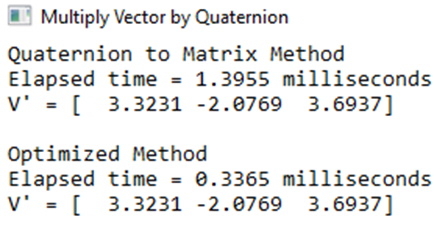

## Introduction
Previously we were able to convert Euler angles to a Quaternion, and a Quaternion to a Matrix. In game programming we want fast 3D rotations, thus this lesson outlines how to rotate a vector by a Quaternion.

## References
* [Faster Quaternion-Vector Multiplication](https://blog.molecular-matters.com/2013/05/24/a-faster-quaternion-vector-multiplication/){:target="_blank"}
* [Rotating a Vector by a Quaternion](https://fgiesen.wordpress.com/2019/02/09/rotating-a-single-vector-using-a-quaternion/){:target="_blank"}

## Matrix Method
### Key Concepts
The key concepts of this part of the lesson are:
* Review of previous concepts:
  * Create a Quaternion from Euler Angles
  * Create a Matrix from a Quaternion
  * Multiply a Vector by a Matrix

### Review Concepts
From Lesson 2.5 we learned that a Quaternion can be created from Euler angles as follows:

Also, from Lesson 2.5 we learned that the conversion of a Quaternion to a matrix was done by:

From Lesson 2.1 we learned that a vector multiplied by a matrix was done by:

Substitution gives us:

Example
Given the Euler angles of Roll = 5o, Pitch = -10o, and Yaw = 15o, the resulting Quaternion would be:

The matrix would be (rounded to 4 decimal places):

Now the final multiplication, given  is:

## Direct (Optimized) Method
The reference for this lesson outlines the following equation for multiplying a vector by a Quaternion:

The product of two Quaternions is given by (given the two quaternions **A** and **B**, where a Quaternion is defined as :

Also `V` must be treated like a Quaternion (i.e., ). The second reference goes through all the detail to get a faster method using the following steps:

The reference stated it was faster, thus the following comparison was done:

## Exercises & Assignments
Compare some previous calculations with this new method. This is the recommended approach for some of the calculations for Lab 2.

### [Outcome Home](outcome2.md)
### [PHYS1521 Home](../)