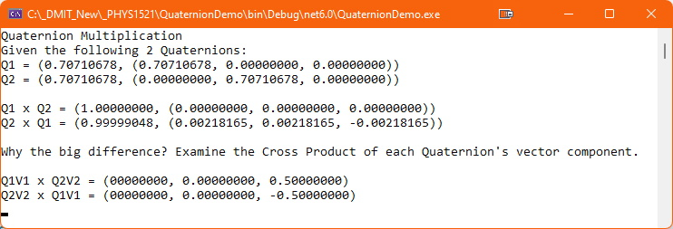

## Introduction
Although not covered in the notes on Moodle, this topic may be of interest for those who want to know more about Quaternions. What is important in this topic is that . This is from the fundamental principle that rotations are not communative.

## Multiplying Two Quaternions
Given , where  and  where , the multiplication of Quaternions follows: 
.

Reversing the order of multiplication gives us: 
.

The non-communative part of these two equations is (they are in opposite directions refer to the [Vector Cross Product](../outcome1/cross-product.md)).

## Sample Calculations
Here are the results of a sample calculation of multiplying two Quaternions: 

Notice the opposite direction of the **z-component** of the results of the Cross Product.
## Exercises & Assignments
There are no exercises or assignments associated with this Addendum.

##### [Outcome Home](index.md)
### [PHYS1521 Home](../)