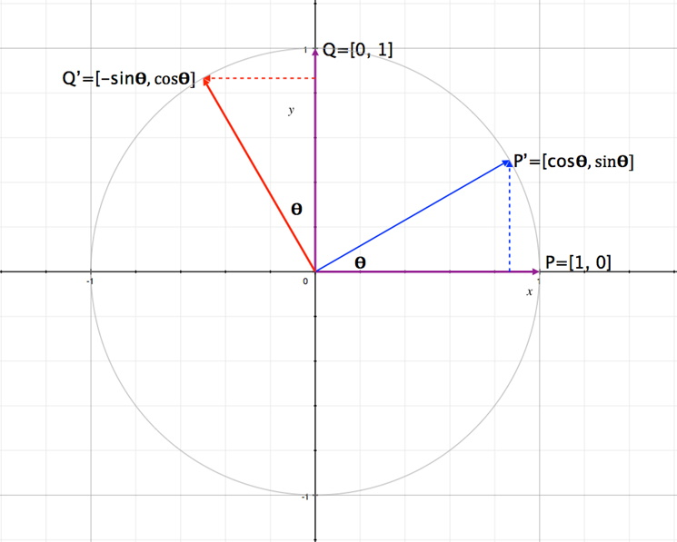
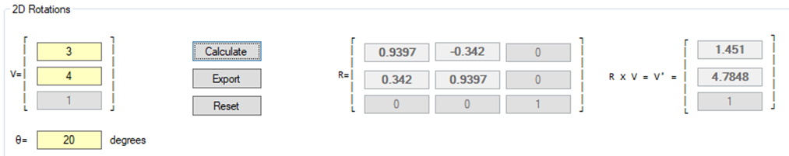

## Introduction
Previously the work with matrices has all be linear transformations, transformations that used matrix multiplication. Linear transformations can be extended to include simple rotations. This lesson uses the 3D and 4D homogeneous coordinate systems for consistency.

### Left-hand Rule (LHR) vs. Right-hand Rule (RHR):
There are many ways in which you can create a 3D coordinate system but the two most common are the LHR and the RHR as shown in the figure below.
 

To visualize this, create a 3D system using your thumb (x-axis), index finger (y-axis), and middle finger (z-axis). Try rotating your left hand to match the LHR, then with your right-hand match the RHR.

## Rotations in 2D & 3D
### Key Concepts
The key concepts of this part of the lesson are:
* Rotation in pure 2D space
* Rotation about a cardinal axis (i.e., simple 3D rotations)
* Euler angles to matrix
* Matrix to Euler angles

### Lesson
To see how rotations work in 3D the 2D system must be covered as it forms the basis of the remainder of this lesson. In 2D, as was stated in the previous lesson, the 2D coordinate system uses a single reference axis, i.e., the z-axis if the coordinate system is extrapolated to the 3D world, or the w-axis to maintain consistency with the final 3D rotations. For now, it is best to “pretend” that the 2D system contains a z-axis. The inclusion of the z-axis is necessary to go from 2D to 3D and then to the 4D homogeneous system. In this 2D world the world is in 3D and the z-axis is the rotation axis.

Earlier a matrix was defined as an array of vectors. Using this in the figure below, with two vectors, P and Q, the following matrix can be constructed:

Rotating the two vectors about an angle θ their positions change (recall basic trigonometry) to **P’** and **Q’**. This new position can be written as the matrix below:

As this was done without including the rotation axis (which was explained as either using the z-axis or the w-axis) the resulting rotation matrix in 3D format is:

_Whether the z-axis or the w-axis is used the resulting rotation matrix does not change the value of z or w._

Example Given the vector, in homogeneous space,  and a rotation angle of 20o calculate the new coordiantes of the vector:

Now that a simple 2D rotation matrix has been defined the next step is to expand this to a 3D system. In a 3D system, there are 3 rotation axes, x, y, and z. For now, the assumption is that the 3D form from above is a rotation about the z-axis. The next question would be what would the matrix look like if the rotation is about the x, or the y axis? First it is important to rewrite the rotation matrix:

For rotation about the x axis the matrix is:

Rotation about the y-axis is:

As with the other linear transformations, each of these rotation matrices need to be put in homogeneous, or 4D, form:

&nbsp;&nbsp;

In each of these new matrices the reference, or w-axis, does not change with any of the rotations, which is the desired result.

Using simple linear transformations only one rotation is done at a time. For example, take a point (2, 1, 4) and rotate it individually about the x-, y- and z-axis with a rotation angle of 90o. The first step would be to construct the individual matrices as shown below but first  and 

&nbsp;&nbsp;

Now perform the multiplication:

As a side note the rotation matrices created above have some common names such as pitch (attitude), roll (bank), or yaw (heading). These terms only make sense relative to the direction of travel in a 3D coordinate space but typically in a LHR system roll is rotation about the z-axis, pitch is rotation about the x-axis. (In a RHR system, roll is about the x-axis and pitch is about the z-axis.)

Considering the multiplication rules for matrices if a rotation were to take place about more than one axis of rotation in each game loop, does the order of multiplication matter? Yes, the order matters (the instructor could take any two of the matrices and multiply them in different order and show that the resulting matrix is not the same; the problem is compounded when using all three rotation matrices). There is a standard that will be used in this class which is Roll-Pitch-Yaw (RPY). The calculation is first Rx x Ry, then this result is multiplied by Rx, 

