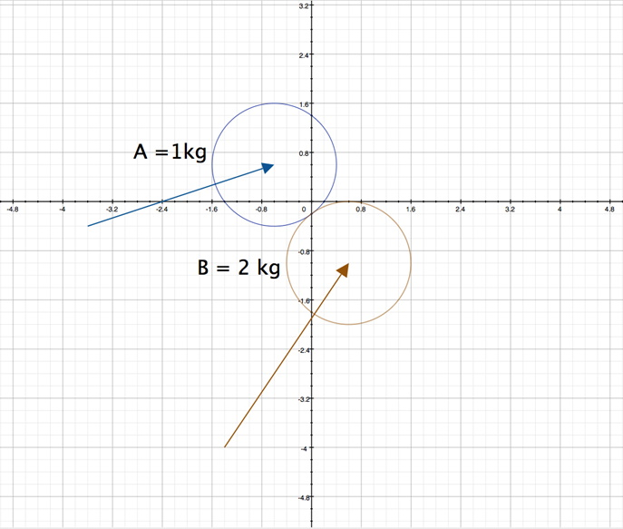

## Introduction
This lesson will include an additional concept related to Linear Mechanics.

## Momentum & Impulse
### Key Concepts
The key concepts for this part of the lesson are:
* Calculations based on Momentum
* Calculations based on Impulse forces

### <a ID="references">References for this lesson</a>
* [Introduction to momentum](https://www.khanacademy.org/science/physics/linear-momentum/momentum-tutorial/v/introduction-to-momentum){:target="_blank"}
* [Momentum: Ice skater throws a ball](https://www.khanacademy.org/science/physics/linear-momentum/momentum-tutorial/v/momentum-ice-skater-throws-a-ball){:target="_blank"}
* [2-dimensional momentum problem](https://www.khanacademy.org/science/physics/linear-momentum/momentum-tutorial/v/2-dimensional-momentum-problem){:target="_blank"}
* [2-dimensional momentum problem (part 2)](https://www.khanacademy.org/science/physics/linear-momentum/momentum-tutorial/v/2-dimensional-momentum-problem-part-2){:target="_blank"}
* [Fast, Accurate Collision Detection Between Circles or Spheres](https://www.gamasutra.com/view/feature/131424/pool_hall_lessons_fast_accurate_.php?page=3){:target="_blank"}

### Lesson
Which object, a 1000kg car or a 5000kg truck, both travelling at the same speed, will come to a stop once their respective drivers stop pressing the accelerator pedals (assuming both at the same time, and both having the same friction on the road surface). The answer should be that the truck will take longer to slow to a complete stop. The reason is that the truck has a larger momentum. Using Newton’s First Law,  and , the equation of Momentum is derived as follows:

Substitute this into the velocity equation

Now some simple algrbraic rearranging

The units of momentum can be expressed as _kg∙m/s_ or _N∙s_. It should also be obvious, based on the equations used, that Momentum is a vector quantity; has both magnitude and direction.

Example: Consider the car and truck from the opening lesson statement, both traveling at 60 km/h calculate the momentum of each vehicle and the time it will take each vehicle to come to a complete stop with a braking force of 10N.

Now calculate the time to stop each vehicle:

Clearly the truck will take 5 times longer to slow to a complete stop, which makes sense as its mass is 5 times that of the car.

The equation  is often referred to as the Impulse equation; one symbol used for Impulse is J but as Impulse is the push to get Momentum this course will use the symbol **P** for Impulse.

As an extension of Newton’s Laws there is a **Law of Conservation of Momentum** which states that momentum in closed system remains constant unless there is an external force. This law can be applied to what is seen in almost every video game, collisions. At this point watch the [Khan Academy videos](#references). Make sure to pause at appropriate spots to check the your understanding of what you have learned so far (you should be able to figure out some steps before the videos explain or show the answers).

After the last video, can you explain why the sample questions assumed perfectly inelastic (car colliding with a stationary truck) of perfectly elastic (the two balls example). In collisions there is a wide range of possibilities between each of these possible extremes. Starting with the general conservation of momentum equation:

 **OR** 

This equation is for perfectly elastic collisions; collisions where no loss of momentum (and thus velocity, or no change in mass) due to friction or objects compressing during the collision. In a pool game simulation, the programmer would almost always use this as there is very little inelasticity of the collisions of pool balls. However, it the game involved something like a beach ball, or other soft, “spongy” ball, there would need to be another form of this equation as the balls during collision would compress then expand back to _normal_ after the collision. This effect is inelasticity and is often seen in bouncing balls in real life.

The factor that needs to be included in the calculations is the **Coefficient of Restitution** ; . When  the collision is perfectly inelastic (object remain as one larger object after the collision), and when  the collision is perfectly elastic (no deformations of the objects during the collision). Anywhere in between the objects are deformed to some degree during the collision.

To solve problems with partially elastic collisions it is necessary to treat each object’s collision separately as each object has its own ε value. The equation shown below, which has the value k as the collision response impulse:

It is important to note that **n** is the normal of the collision point.

A more interesting case, which is quite common in video games such as a game of pool or billiards, is that of two objects colliding. Often these objects do not collide in a direct path, but more often collide in glancing blows (see the [Gamasutra reference](#references) for more details). For this begin with two circular objects, A with a mass of 1 kg and B with a mass of 2 kg. The equation for the circles at (very near) to the collision point are:

A: 

B: 

This gives the centers of each circular object as  and  as shown in the figure below: 

To know that these two circular objects are in contact, calculate the distance between the centers of the objects. If this distance is exactly the sum of the two radii, then they are contacting in exactly one point.

Now that a collision is possible, consider the initial velocities of the objects are  and 
