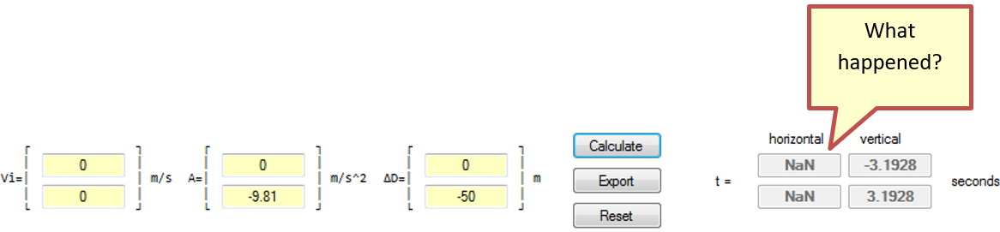

## Introduction
In this next part of the course, it can be too tempting to go too in-depth with Calculus. The calculus that is used in many references is too complex for the nature of this course. It is key that the students understand vectors as these will be used almost entirely in this section of the course.

## Basic Quantities and Units
### Key Concepts
The key concepts for this part of the lesson are:
* Understand the basic units of the SI (metric) system used in physics.

### Lesson
In this course the standard units of measure will be:
* _time_: seconds
* _distance_: meters

## Velocity
### Key Concepts
The key concepts for this part of the lesson are:
* Calculating average velocity.
* Understanding instantaneous velocity.

### Lesson
How to distinguish between _speed_ and **velocity**; _speed_ is a _scalar_, while **velocity** is a vector; often these two words are used interchangeably but they are not the same thing. Most people know that speed is a measure of distance over time, i.e., km/h, m/s, mph (miles per hour).

#### Average Velocity
Consider the problem of the tortoise and the hare. The tortoise moves at a steady pace throughout the race, while the hare runs very fast, rests for a time, continues running and resting until the end of the race is reached. If both the tortoise and the hare reach the finish line at the same time which one has the greater average velocity? The answer is they both have the same average velocity. How can this be so? Both travelled the same distance (displacement) over the same time. This yields the basic formula:

However, if a plot is made of each animal’s progress it does not appear to make sense as the hare accelerates and decelerates (acceleration will be discussed later in this lesson) and thus its _speed_ is constantly changing; in fact, at any given point on the plot the _speed_ of the hare is different than the _speed_ of the tortoise. Also, between any two points on the plot the average _speed_ of the hare could be zero. It is the overall result, as shown in the formula above that is important.

Example: Calculate the average velocity given that an object at , with , travels to a point  at an ending time of :

It is important here that normally units of measure are used. In a game the units of measure are not as important as the game play results but, in this course, get used to using units; the answer of 10 from the example above does not mean anything, but  does; all final answers will include units of measure, but the detailed calculations do not require units of measure (mostly they just get in the way).

#### Instantaneous Velocity
In the tortoise and hare scenario above it was noted that at some points along the path the tortoise had a greater instantaneous velocity, while at other places the hare’s instantaneous velocity was greater. Simply using the formula for average velocity will not always work when the instantaneous velocity is needed.

## Acceleration
### Key Concepts
The key concepts of this part of the lesson are:
* Understand the relationship between velocity and acceleration.
* Calculate motion under constant acceleration.

### Lesson
What is the definition of acceleration. Must acceleration always be positive (negative acceleration means to slow down, i.e., braking). The dropping a ball bearing from the top of a building is a good example to show acceleration due to gravity. Starting at an initial velocity of zero and adding acceleration for each second the resulting equation is:

When A=0 there is a constant velocity, or no change in velocity. When A > 0 a plot of the motion is like a ∪, and when A < 0 the plot looks like a ∩; these shapes are to represent parabolic curves.

The general equation of motion given an initial velocity and a constant acceleration:

In the example of dropping the ball bearing from the building the velocity after each second was calculated but not how far it had travelled. This _distance_ is called **displacement** and can be calculated. For example, how far would the ball bearing travel, from rest, after 1 second?

Questions:
* Does this answer make sense? If so, or not, why?

Now how far would the ball bearing travel in the next second?

Check:
* Compute the displacement after 2 seconds and compare this result to that of adding the two separately calculated displacements:

It is important to note that  and that ∆D is a relative change in displacement.

_Note this shows input and results as 2D Vectors which is the “reality” of this scenario._

So far it was possible to compute final velocity and displacement under constant acceleration. Is it possible to calculate the time it takes to travel a given distance knowing the constant acceleration and the initial velocity? The answer is yes, and the calculation relies on adapting the Quadratic Formula:

This equation is derived from the equation . Rewriting our equation for displacement to  appropriate substitutions can be made into the Quadratic Formula to get:

There is one more rearrangement of this equation that may be useful in the future:

Now there is a problem, which root is used, the +’ve or the –‘ve root? At this point it is best to do the calculations for both roots and determine which value of t makes sense. For example, if the ball bearing falls from the top of the building to the ground below, 50m, how long would it take to fall?

**OR**

Questions:
* Why is ∆D negative?
* Which root?
* Is it now possible to calculate the velocity of the ball bearing just as it hits the sidewalk?

Questions:
* Why is the final velocity negative?
* Why does the mass of the ball not factor into this scenario?
* What would happen if air resistance were factored in?

All of this is great, but this is simply dropping an object which is hardly a common experience in a video game, especially a first-person shooter, or any game in which involves projectiles. Additionally, it would be possible to toss the ball upwards first, throw it straight down, or throw it at any possible angle and velocity. How would any of these conditions affect the motion of the ball bearing?

Come up with ideas to solve projectile motion before going into any detail. Draw the first scenario as shown in the below. Do not draw the trajectory unless the students have not figured this path out. In this type of problem there is an additional requirement to find out how far the projectile travelled horizontally before reaching the ground.

The solution to this type of problem is to split the motion into its two components, vertical (y) and horizontal (x). In doing this the velocity vector is  and accleration is . In the previous example it was possible to calculate the time it took the ball bearing to reach the ground. This time was for the vertical component of the motion (there was no horizontal motion in the previous example). In this scenario the time is the same for both the vertical and the horizontal motion, therefore once this time is calculated it is possible to calculate the distance travelled.

In the horizontal motion there is no acceleration therefore:

Now use the figure below: 

In this scenario, the initial velocity has both an x-component and a y-component; . How does this change the calculations? Once again, the time it takes the ball bearing to fall to the ground vertically is the same time the ball bearing travels horizontally. Yet now the ball bearing travels upwards to a point where its vertical velocity reaches 0, then proceeds to fall to the ground. As in the previous scenario the calculation of time is the first step; recall from a previous example that the equation to calculate time when the initial velocity is not 0 is:

Given θ=30o calculate the time of travel of the ball bearing, the distance travelled horizontally and the maximum height of the projectile.

Obviously, the value of t used will be 1.8847s. In the horizontal direction:

What about max height? At the peak of the trajectory path the y-component of velocity is 0 therefore some formula is required to calculate this. Starting from what is known:

Using the first of the motion formulas the value of t to get to the apex is:

Interesting result yet there is still the other formula so with a little substitution:

