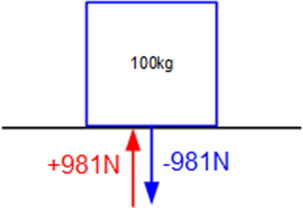
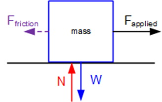
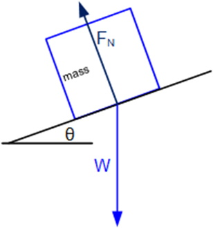
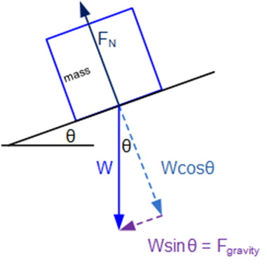
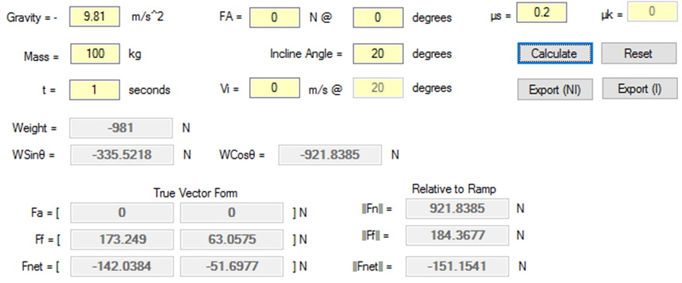

## Introduction
This lesson will extend the concepts learned in Lesson 3.1 to include how to get object moving and what happens when they are moving. To accomplish use this introduction of Newton’s Laws.

Modern mechanics has evolved from the classical mechanics of Sir Isaac Newton; the inclusion of the work by Albert Einstein, and others, has changed, somewhat, the work done by Sir Isaac Newton. The fundamentals of Newton’s work is summarized in his three laws.

>**Newton's First Law** Every body persists in a state of being at rest or of moving uniformly straight forward, except insofar as it is compelled to change its state by force impressed.

>**Newton's Second Law** The acceleration of a body is proportional to (and in the same direction as) the net external force acting on the body, and inversely proportional to the mass of the body: 

>**Newton's Third Law** To every action there is always an equal and opposite reaction. Or, the force of two bodies on each other are always equal and directed in opposite directions.

So, looking at the 1st law why does an object not keep moving, it eventually comes to a stop, after it is compelled to move? Friction. Friction is an external force that opposes motion, but it was quite the statement in its day. Also, a force is required to move an object.

The 2nd law’s formula is so simple but very important; it is fundamental to this lesson. Using the standard units for mass and acceleration we get:

It is important that a force does not produce velocity, only acceleration; an application of the linear motion equations from lesson 3.1 will yield a given velocity, and displacement, over a period.

Finally, the 3rd law. This law will come into play in almost every situation. For example, a body that is seen to be not moving does not mean that there are no forces acting on it, simply that this could be true, or all the forces balance each other out in opposite directions and thus no motion.

One thing that is important in real world physics is that the continued application of an applied force, over a very large period, does not result in speeds greater than the speed of light. Additionally, as Einstein formulated, and what has been learned so far, everything is relative to a certain view of the world, game world or real world.

## Simple Forces
### Key Concepts
The key concepts for this part of the lesson are:
* Calculation of net force
* Calculation of acceleration on a body

### Lesson
As an application of the 1st and 3rd laws consider an object sitting at rest on a table, or other suitable platform. What is known about this object? It has _mass_, and therefore **weight** (please note that _mass_ and **weight** are different). All force values must be vectors; examining the 2nd law it should be obvious that this is a vector multiplied by a _scalar_, which results in a vector.

The value of **-981N** is the result of the 1st law: 

The other value, **981N**, balances out weight, . What is this force? This is the equal and opposite force of gravity (3rd law) called **Normal Force** (FN); FN is a reactive force in that it is the _surface pushing back_, _assuming it does not bend or break_, and will increase and decrease depending on the weight of the object resting on the surface.

Consider the scenario shown in the figure below in which an external force is applied to the object. 

In this scenario what would have to exist for the block to move? _The applied force must overcome friction_. How can the amount, magnitude, of friction be determined? _The value of friction depends on the surfaces involved and whether the object is initially at rest or initially moving_. It is important here to make mention that Friction, like Normal Force, is a reactive force, and will increase to a maximum value before the object will be able to move.

The two types of Friction are static (the object is not moving) and kinetic (the object is already in motion). The notations will be Fs and Fk respectively, and are calculated as:

 and 

Refer to an internet source, for some standard values of μ.

As an example, using the scenario shown in the figure above, with  and  calculate Fnet:

The direction of this vector must be opposite the relative motion of the surfaces, or . Next calculate the net force. To do this correctly **all** external forces must be used and used as vectors.

Questions:
* Why do friction and applied force have no y-component?
* What if the applied force was only 150N?
* What is the acceleration on this object?

Consider the scenario shown in the figure below, where the object is at rest on an inclined surface. 

Note that weight is always perpendicular to the ground, not the surface the object is resting on, and Normal Force is always perpendicular to the surface the object is resting on. As the surface, not the ground, is responsible for providing FN. The weight vector needs to be split into its components, relative to the surface, not the ground as shown in the figure below. 

_Note: It can be proven that the angle θ of the incline is the same angle of the right triangle formed by the components of weight._

Question now is whether the object is moving or not. In this initial state which direction is friction? _It will be up the ramp regardless of the whether the object is moving or not_. Using the same object, and friction coefficient as before, but now have the ramp angle at 10o calculate net force. First calculate weight.

Next calculate :

Next the maximum friction:

Determine if the object is moving. It is clear that  therefore the object is at rest; the x-component of gravity was not sufficient to overcome friction, therefore . What would happen if the incline angle were increased to 20o?

At this point it should be clear that the x-component of weight exceeds, in magnitude, the maximum value of friction, therefore the object will be moving down the ramp:

