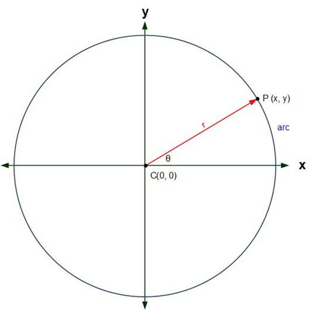
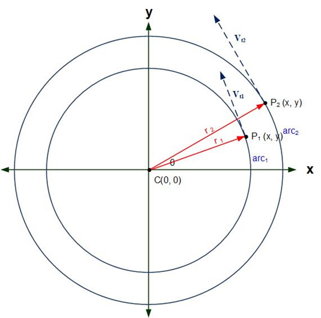

## Introduction
This lesson will extend the concepts learned in Lesson 3.1 to motion that is circular, i.e., motion of an object in a circular path about a specific point. There will be some new terminology which some students may already know the names but not the formal definitions.

## Uniform Circular Motion
### Key Concepts
The key concepts for this part of the lesson are:
* Understand circular motion.
* Calculate motion properties of a rotating body.

### Lesson
#### Angular Velocity
If an object is traveling in a circle the path of the object is circular, not linear as shown in the figure below. 

Examining this figure, the value of the radius has no effect on the change in angle. The formula for angular velocity is:

#### Angular Acceleration
If the rate of change of angle increases, or decreases, (i.e., ω changes), then there is acceleration. The formula for angular acceleration is:

We can now use the knowledge from Linear Motion to get the following equations:

#### Tangential Velocity
What about the _physical_ velocity, i.e., the velocity felt at a point on a circle? In the figure, below, we see a possible scenario: 

Here we see that arc1 is smaller in length than arc2, which should tell us that, physically, P2 is travelling faster than P1; it may not be obvious, but Vt1 has a smaller magnitude than Vt2. This physical speed is Tangential Velocity. The formula for this is:

Doing some substitution, we can determine the relationship between angular velocity and tangential velocity:

