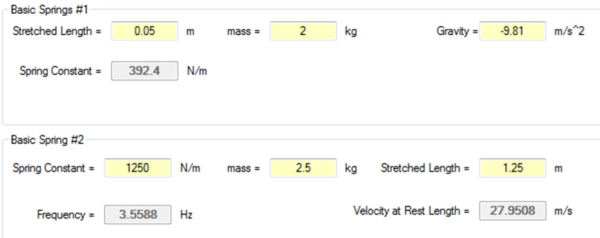
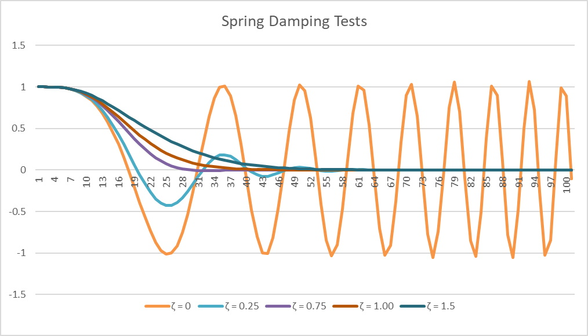

## Introduction
This lesson will include an additional concept related to Linear Mechanics.

## Key Concepts
The key concepts for this part of the lesson are:
* Understand the basics of Spring forces

### Lesson
Spring forces are much more prevalent in game programming; any video game that closely simulates the driving of a vehicle uses springs. Naturally, springs want to stay in their current state and will contract to this state if extended and extend to this state if compressed. However, the returning to the state of rest often produces a bounce effect, or harmonic oscillation.

The formula for springs, known as Hooke’s Law, is:

 **OR** 

In this formula, _k_ is the spring constant, which is an indication of the stiffness of the spring. In order for the formula to balance correctly, in terms of units, _k_ cannot be a pure number; its units are N/m. The l<sub>rest</sub> variable represents the length of the spring at rest, and l represents the length, either stretched or compressed. There are some basic calculations that could be done with springs, one of which is done to calculate the k of a spring:


Or the length of a spring given an applied force:


As interesting as these could be the importance of springs is on the motion properties of an object affected by a spring.

 yields  where 

Imagine hanging an object from the end of a spring that is attached to a surface. After the object is released, the spring begins to extend and contract in _cosine wave-type_ manner until the spring is extended to a final position (the correct way to solve this is with differential equations which are way, way beyond the scope of this course).

As the pattern closely resembles a cosine wave, we can calculate the angular frequency:

 where  is the angular frequency

Therefore, as ω is measured as radians/second it is possible to measure the frequency of the oscillation:


#### Example 1
Given an object of mass 2.0 kg suspended from a spring, with a stretched by a length of 5.0cm calculate the spring constant (assume earth’s gravity).


Therefore


#### Example 2
Using the same spring as in Example 1 a different mass is hung from the spring and stretches the spring to 3.5 cm. What is the mass of the object hung from the spring?


#### Example 3
Given a spring with a spring constant of 1250N/m and a 2.5 kg mass attached to it, sliding frictionless, that stretches the spring to 12.5 cm. Calculate the frequency of oscillation and the speed of the object as it passes through the rest position of the spring.


For the second part of this example, the velocity, use the formula:


Here A is known (stretched length, or amplitude of the oscillation, NOT gravity) and:


Also,  therefore  where 

**Note**: the  above depends on the direction the spring is moving.

Next substitute:




## Spring Damping (Optional)
In many scenarios it is necessary to control the frequency, especially for “virtual springs”. In these cases, the equation of motion is written as:


As springs will not oscillate forever, there are two interesting forces with springs, **driving force** and **damping force**.

**Driving Force**: this force acts as an input to the system to cause the motion to begin and is generally similar to applied force.

**Damping Force**: this force acts like friction but does not depend on a Normal Force, instead it is defined as:


From this, applying Newton’s Laws:


Rewriting this, knowing that  the damping ration can be defined as:


There is a lot of math to solve this type of equation, but what is important is the value of ζ (zeta) as shown in the table below:

\zeta | Condition | Result
------|-----------|-------
 | Not damped | No change in oscillations; never reaches equilibrium
0"/> and  | Underdampled | Reach equilibrium fastest but oscillates in doing so
 | Critically damped | Reach equilibrium as fast as possible
1"/> | Over damped | Reach equilibrium at a slower rate than critical damping

Using the code, shown in the listings below, and plotting the results using Excel, gives the following, shown in the figure below (**note that the results for ζ = 0 are not as expected, likely due to using Euler Integration, not a precise method, but it does show that no equilibrium is reached**):

```csharp
namespace SpringDampingTest
{
    public class SpringDamper
    {
        // Properties
        public double position { get; set; }        // stretched position of the spring
        public double setPoint { get; set; }        // rest position of the spring
        public double velocity { get; set; }        // velocity of the spring
        public double dampCoefficient { get; set; } // damping coefficient
        public double springConstant { get; set; }  // spring constant, k

        // Constructors
        public SpringDamper() { }//eom

        public SpringDamper(double position, double setPoint, double velocity, double dampCoefficient, double springConstant)
        {
            this.position = position;
            this.setPoint = setPoint;
            this.velocity = velocity;
            this.dampCoefficient = dampCoefficient;
            this.springConstant = springConstant;
        }//eom

        // Class Method
        public void Update(double deltaTime)
        {
            double error = position - setPoint;
            double acceleration = -1 * error * springConstant - dampCoefficient * velocity;
            // Euler Integration
            velocity += acceleration * deltaTime;
            position += velocity * deltaTime;
        }//eom
    }//eoc
}//eon
```

```csharp
namespace SpringDampingTest
{
    class Program
    {
        static void Main(string[] args)
        {
            double pI = 1;
            double sP = 0;
            double vI = 0;
            double c = 1.0;
            double k = 1.0;
            double mass = 1;
            double zeta;
            SpringDamper sd = new SpringDamper(pI, sP, vI, c, k);
            zeta = c / (2 * Math.Sqrt(mass * k));
            Console.WriteLine("k = {0}, mass = {1}, c = {2}", k, mass, c);
            Console.WriteLine("Zeta = " + zeta);
            Console.WriteLine("position, time, velocity");
            for (int dt = 0; dt <= 100; dt++)
            {
                sd.Update(dt / 100.0);
                Console.WriteLine(Math.Round(sd.position, 8) + "," + dt / 100.0 + "," + Math.Round(sd.velocity, 8));
            }//end for
            Console.ReadLine();
        }//eom
    }//eoc
}//eon
```



## Exercises & Assignments
Complete the [Springs Worksheet](springs-worksheet.md). Once completed, and the [Gravity Worksheet](gravity-worksheet.md) is completed, proceed to Moodle to complete Knowledge Checks 13 (strongly recommended to be completed prior to attempting Lab 3).

### [Outcome Home](outcome3.md)
### [PHYS1521 Home](../)

