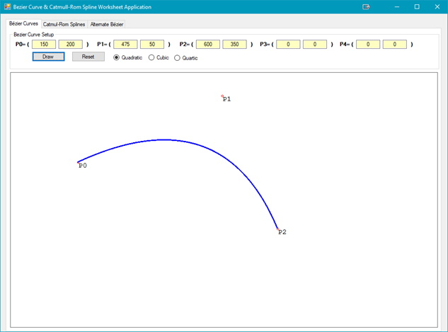
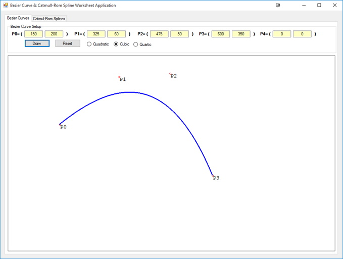
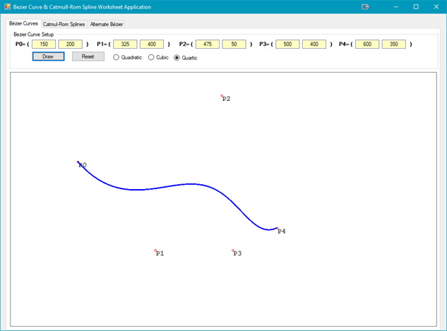

## Introduction
In this next part of the course the math involved with Bézier curves can be very complex. The intention of this outcome is to provide the student with a basic understanding of the importance of Bézier curves and how they apply to game programming.

## Parametric Polynomial Curves
### Key Concepts
The key concepts for this part of the lesson are:
* Understand the relationship between polynomial curves and parametric curves

### Lesson
There is a lot of detailed math, much of which will be simplified (most of the implementation of Bézier curves will be done by the game engine). Curves are used extensively in game programming, and in game design. They are used to represent motion paths, trajectories as well as some graphical properties.

The definition of _polynomial_ and _parametric_ curves is shown below (the example given is for a circle):

Polynomial Form | Parametric Form
----------------|----------------
 | <br>

In the parametric form the value of _t_ can be infinite but usually has a defined range, i.e. contains all the points from 0 to 1 inclusive. As curves are both simple and complex the polynomial form is given as degrees as shown in the expression below:


**OR**


The second form can be written in matrix form:


 and 

The matrices **C** and **t** can be multiplied:


Since the values of t (aka the endpoints) are typically finite we can calculate the results for each endpoint. For now, let us use  and . The results are:


Q. What does this say about the endpoints?

## Polynomial Interpolation
### Key Concepts
The key concept of this part of the lesson is:
* Describe the difference between linear and polynomial interpolation

### Lesson
There are two terms to define:
* Linear Interpolation: a function that describes a constant rate of change between the two end points
* Polynomial Interpolation: a function that describes a variable rate of change from the start point to the end point with intermediate control points between the start and end.

The most useful, and often studied, version of polynomial interpolation is a cubic form which interpolates over four control points (as will be shown in the next section).

## Bézier Curves
### Key Concepts
The key concepts of this part of the lesson are:
* Define a Bézier curve
* Understand the parametric equation for a Bézier curve

### Lesson
A Bézier Curve is defined by two end points and from one to many intermediate control points:
* 0 control points = linear (straight line)
* 1 control point = quadratic
* 2 control points = cubic
* 3 control points = quartic

An example of a Quadratic Bézier Curve is shown in the figure below, and a Cubic Bézier Curve in the figure below that. In this figure, the two end points are P(0) and P(2), with P(1) as the control point. Note that as the curve is drawn between P(0) and P(2) the line first begins to approach P(1), but never reaches P(1), then begins to move towards P(2).[The coordinates used are upper left at (0,0).]

<br>

Not that in the figure above, the Bezier Curve has an additional control point, P(2); P(3) is now the end point.

The position of the control points will define the curve as shown in the below:<br><br>

In the figure note that the curve begins to move from P(0) to P(1) but the position of P(2) causes the loop in the path. So why is this happening, not only for this curve, but for all Bézier curves? Watch the [Vimeo Video](https://vimeo.com/106757336){:target="_blank"}.

For the cubic Bezier curves shown in the figures above the following code was used:

```csharp
public static Eng_Vector2D QuadraticBezier(double t, Eng_Vector2D p0, Eng_Vector2D p1, Eng_Vector2D p2)
{
    double ts = 1 - t,
        ts2 = ts * ts,
        t2 = t * t;
    return p0 * ts2 + 2 * p1 * t * ts + p2 * t2;
}//end of QuadraticBezier
```

```csharp
public static Eng_Vector2D CubicBezier(double t, Eng_Vector2D p0, Eng_Vector2D p1, Eng_Vector2D p2, Eng_Vector2D p3)
{
    double ts = 1 - t,
        ts2 = ts * ts,
        ts3 = ts2 * ts,
        t2 = t * t,
        t3 = t2 * t;
    return p0 * ts3 + 3 * t * p1 * ts2 + 3 * p2 * t2 * ts + p3 * t3;
}//end of CubicBezier
```

```csharp
public static Eng_Vector2D QuarticBezier(double t, Eng_Vector2D p0, Eng_Vector2D p1, Eng_Vector2D p2, Eng_Vector2D p3, Eng_Vector2D p4)
{
    double ts = 1 - t,
        ts2 = ts * ts,
        ts3 = ts2 * ts,
        ts4 = ts3 * ts,
        t2 = t * t,
        t3 = t2 * t,
        t4 = t3 * t;
    return p0 * ts4 + 4 * p1 * t * ts3 + 6 * p2 * t2 * ts2 + 4 * p3 * t3 * ts + t4 * p4;
}//end of QuarticBezier
```

The above methods calculate a point on the Bézier Curve. The listing below shows how to call the code in the first code listing, as well as the other orders of Bézier Curves. This code works as there are 2 overload methods in the **Eng_Vector2D.cs** class as shown below:

```csharp
public static Eng_Vector2D operator *(Eng_Vector2D v, double scale)
{
    return new Eng_Vector2D(v.X * scale, v.Y * scale);
}//eom
public static Eng_Vector2D operator *(double scale, Eng_Vector2D v)
{
    return new Eng_Vector2D(scale * v.X, scale * v.Y);
}//eom
```

```csharp
// draw the Bezier curve
Eng_Vector2D pointPosition;
for (double t = 0; t <= 1.0; t += 0.001)
{
    switch (rb)
    {
        case 1:
            pointPosition = Calculator.QuadraticBezier(t, points[0], points[1], points[2]);
            break;
        case 2:
            pointPosition = Calculator.CubicBezier(t, points[0], points[1], points[2], points[3]);
            break;
        default:
            pointPosition = Calculator.QuarticBezier(t, points[0], points[1], points[2], points[3], points[4]);
            break;
    }
    g.DrawEllipse(pt, Convert.ToSingle(pointPosition.X), Convert.ToSingle(pointPosition.Y), 2, 2);
}
```

Note that the methods to calculate a point on the Bézier Curve require a time slice parameter. The ‘for loop’ provides this parameter. If the incrementing of t is smaller and smaller the smoother the curve becomes. Upon closer examination you will see that the code in these methods is of the form:

**Quadratic**: 

**Cubic**: 

There are two algorithms to compute a Bézier Curve. Essentially the expanded equation above will work (as demonstrated with the code supplied.

What about higher order Bézier Curves? They are certainly possible and do, in fact, exist and have their own parametric equation. The pattern that would be followed is (from order n = 0 to n = 6; there is a pattern):<br>


In the pattern above note that the `1 2 1` is the numbers from the Quadratic Bézier, and `1 3 3 1` is the Cubic form. (Do you see the pattern?)

A Quartic Bézier Curve has the parametric equation of:


Adding an additional control point to the list of points, P3, making the end point now P4 we get the following Bézier Curve:<br>


Most mathematicians will use that algorithm. For game programmers, they would rely on built-in functions of the game engine (unless they are building their own engine).

For even higher order Bézier Curves the following applies, which is the general expression for an n-order Bézier Curve:


Where _n_ represents the order of the Bézier Curve, _t_ represents the time slice, and _P<sub>i</sub>_ represents one of the points, either an end point or a control point. Coding this requires a little more work, but essentially, we can have just one method that will calculate the point on the curve regardless of the order of the curve. This approach could be computationally slower than using separate methods for each order of a Bézier Curve.

```csharp
public static Point2D Bezier(List<Point2D> points2D, double t)
{
    Point2D b = new Point2D(0, 0);
    int n = points2D.Count - 1;
    for (int i = 0; i <= n; i++)
    {
        b += CFactorial(n, i) * Math.Pow(1 - t, n - i) * Math.Pow(t, i) * points2D[i];
    }
    return b;
}//eom

public static Point3D Bezier(List<Point3D> points3D, double t)
{
    Point3D b = new Point3D(0, 0, 0);
    int n = points3D.Count - 1;
    for (int i = 0; i <= n; i++)
    {
        b += CFactorial(n, i) * Math.Pow(1 - t, n - i) * Math.Pow(t, i) * points3D[i];
    }
    return b;
}//eom

//This is the (n!/(i!(n-i)!)
private static int CFactorial(int n, int i)
{
    int result = Factorial(n) / (Factorial(i) * Factorial(n - i));
    return result;
}//eom

private static int Factorial(int n)
{
    int nfactorial = 1;
    while (n > 1)
    {
         nfactorial *= n;
         n--;
    }
    return nfactorial;
}//eom
```

With 2 end points and 6 control points:<br>


What about in 3D? The same rules apply. The figure below illustrates a 3D Bézier Curve.<br>


## Exercises & Assignments
Complete the [Bézier Curve worksheet](bezier-worksheet.md) using the [CurveSplineWorksheet application](https://github.com/allanNAIT/allanNAIT.github.io/releases){:target="_blank"} (also found in the Additional Resources folder on Moodle). (Knowledge Check for this lesson is part of Knowledge Check 15 - Curves & Splines.)

#### [Outcome Home](index.md)
#### [PHYS1521 Home](../)