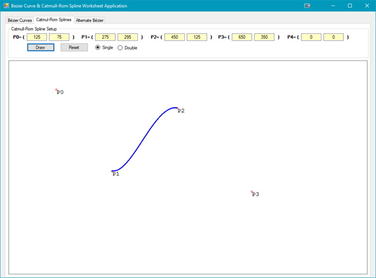
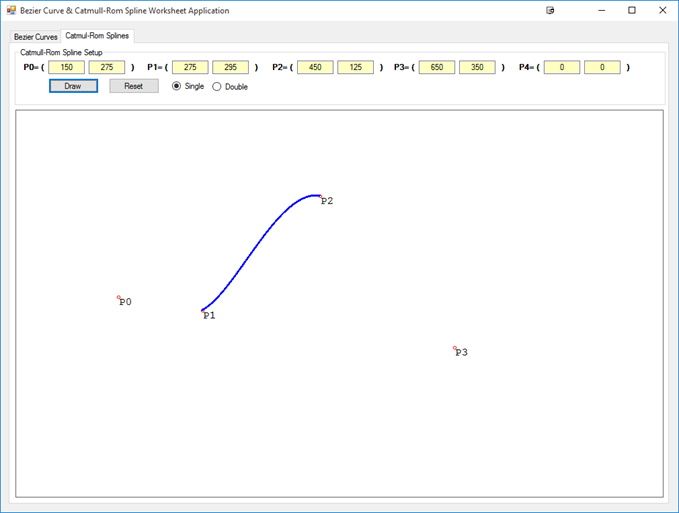
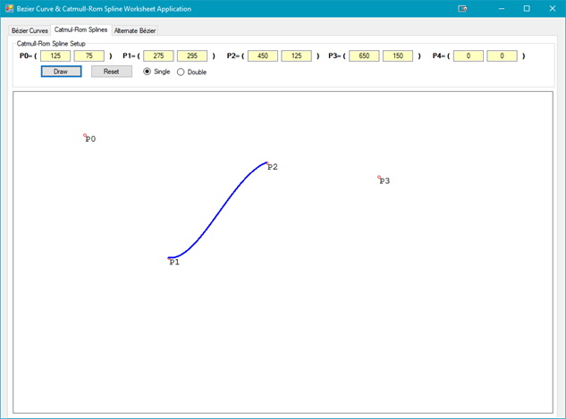
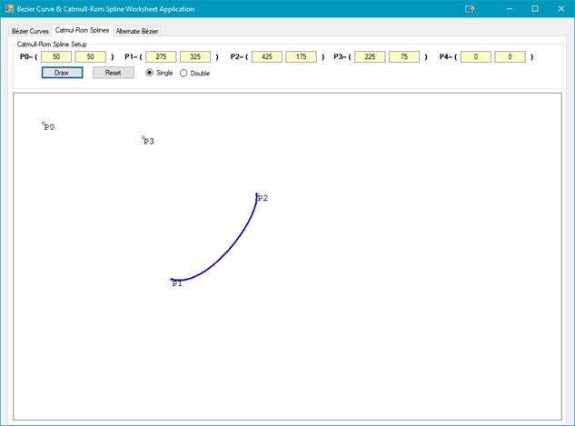
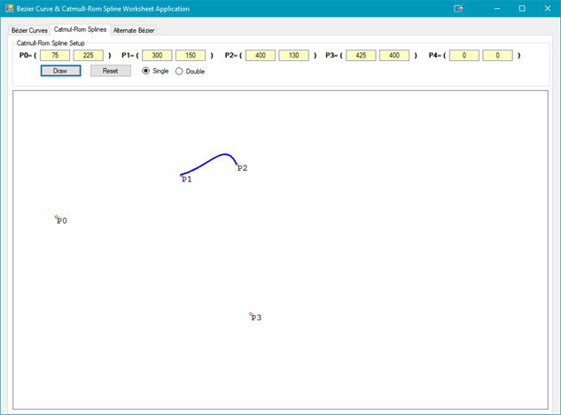
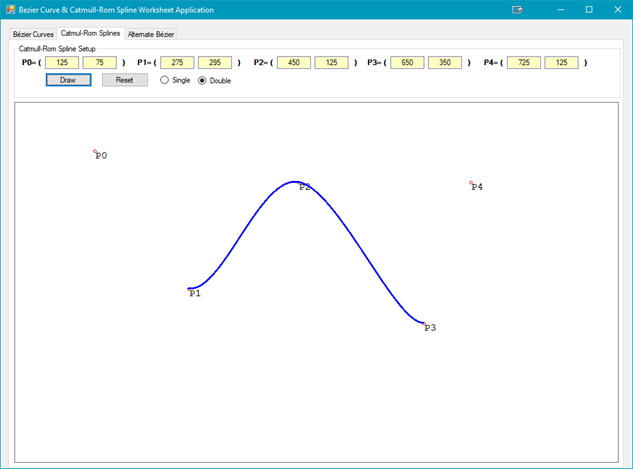
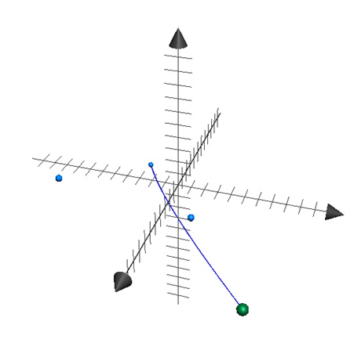

## Introduction
In this next part of the course the math involved with splines can be very complex. Add to this that there are many types of cubic splines, of which Catmull-Rom is only one of them. The intention of this outcome is to provide the student with a basic understanding of the importance of Catmull-Rom splines and how they apply to game programming.

## <a ID="references">References</a>
* [Centripetal Catmull–Rom spline](https://en.wikipedia.org/wiki/Centripetal_Catmull%E2%80%93Rom_spline){:target="_blank"}
* [Introduction to Catmull-Rom Splines](http://www.mvps.org/directx/articles/catmull/){:target="_blank"}
* [Interpolation in Unity with C#](https://www.habrador.com/tutorials/interpolation/){:target="_blank"}

## Cubic Splines
### Key Concepts
The key concept for this part of the lesson is:
* Understand the relationship between curves and splines.

### Lesson
Curves are used extensively in game programming, and in game design. They are used to represent motion paths, trajectories as well as some graphical properties. Splines are short curve segments.

## Catmull-Rom Spline
### Key Concepts
The key concepts for this part of the lesson are:
* Define a Catmull-Rom Spline
* Understand the parametric equation for a Catmull-Rom Spline

### Lesson
This part of this part of the lesson will use the [external references](#references) as they explain the concepts at a level that is more beneficial to you.<br>


From the figure above you should notice that the spline curve is only between P(1) and P(2). The other two points, P(0) and P(3), are the control points for the curve; changing P(0) and/or P(3) will change the shape of the spline. If only P(0) is changed then the main section of the spline that is affected is mainly near P(1) but does affect the entire spline curve:<br>


If only P(3) is changed then the main section of the spline that is affected is near P(2) but also the rest of the spline:<br>


The splines that can be created are not nearly as intricate as the Bézier Curves. Some of the types of splines that can be created as shown in the figures below:<br>
<br>


Now that the shape of the Catmull-Rom Spline is visualized, how are they created? The demo code used is an implementation of the [MVP reference](#references) and is shown in the code listings below:

```csharp
public static Eng_Vector2D CatmullRomSpline(double t, Eng_Vector2D p0, Eng_Vector2D p1, Eng_Vector2D p2, Eng_Vector2D p3)
{
    double t2 = t * t,
        t3 = t2 * t;
    return 0.5 * ((2 * p1) + (p2 - p0) * t + (2 * p0 - 5 * p1 + 4 * p2 - p3) * t2 + (p3 - p0 + 3 * p1 - 3 * p2) * t3);
}//end of CatmullRomSpline
```

Like the Bézier Curve, this method requires a time slice parameter. The listing below shows how to call the code in the listing above, as well as adding a second spline the curve:

```csharp
// draw the Catmull-Rom Spline
Eng_Vector2D pointPosition;
for (double t = 0; t <= 1.0; t += 0.001)
{
    pointPosition = Calculator.CatmullRomSpline(t, points[0], points[1], points[2], points[3]);
    g.DrawEllipse(pt, Convert.ToSingle(pointPosition.X), Convert.ToSingle(pointPosition.Y), 2, 2);
    if (rb > 1)
    {
        pointPosition = Calculator.CatmullRomSpline(t, points[1], points[2], points[3], points[4]);
        g.DrawEllipse(pt, Convert.ToSingle(pointPosition.X), Convert.ToSingle(pointPosition.Y), 2, 2);
    }
}
```

Unlike Bézier Curves there is no way to have a spline go between more than two points. To achieve the curve between more than two points, and to include those points, the splines must be joined together. The figure below shows the results. The first spline is between P(1) and P(2), and the second between P(2) and P(3).<br>


It is also possible, but not shown in the notes, or with the application, that more than two Catmull-Rom splines can be joined together.

What about 3D? The same rules apply. The figure below illustrates a Catmull-Rom Spline between two points:<br>


## Exercises & Assignments
Complete the [Catmull-Rom worksheet](spline-worksheet.md) using the [CurveSplineWorksheet application](files/CurveSplineWorksheet.exe) (also found in the Additional Resources folder on Moodle). Once complete proceed to Moodle to complete Knowledge Check 15 - Curves & Splines (strongly recommended to be completed prior to attempting Lab 4).

### [Outcome Home](outcome4.md)
### [PHYS1521 Home](../)
