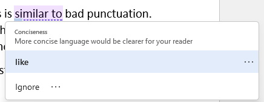

 **Report Proofing**

## Introduction
One aspect of communications is a formal report document. To have your meaning clear and concise it is necessary to configure the proofing options in Microsoft Word. Once this is done, any document that you create, or open for reading, will be checked against the proofing options.

## Proofing Options Setup Steps
To configure the proofing options, you can either start with a document you want to read and/or edit, or with a blank document.

1. Click on **File** from the main menu and select **Options**: 

2. From here select **Proofing** and then **Settings** (next to **Grammar & Refinements**): 

3. The following options need to be set:
    1. Space between sentences 
    
    2. Formality settings: 
    
    3. Vocabulary settings: 
    
4. Press **OK** to save these settings.

## Checking/Proofing a Document
Once all the settings have been made (note that there are many more settings that are/should be automatically set in Word) you can type/edit a document.

### Example
Consider the following example document: 

Notice that Word identified several errors that need be corrected. One that is not obvious is the two spaces between sentences. To easily see this, you need to turn on hidden characters (recommended when creating/editing a document – these are non-printable characters): 

Once you do this, the display in Word changes to: 

Now you can see the two space characters between the first two sentences. Additionally, you can see the extra space after the sentence in the third paragraph.

The first noticeable error is the contraction. As this not allowed in a formal report, you can see the correction by clicking on the error to see: 

You can select the correction Word provides, which is preferable in almost all situations, or you can ignore the error.

The error in the second sentence can be checked and corrected in a similar manner: 

There are three examples of the missing comma, often referred to as the **Oxford Comma**. They can be corrected as shown below: 
 

The last wording error is an example of a common mistake in formal reports (Word detects this as not being concise): 

### Corrected Document
Once you have made all the corrections, your document should display as follows: 

## Rechecking a Document
There are times and situations where Word does not always check the document for grammar and punctuation. In these times and situations, you can manually recheck the document: 

When this is selected, Word will ask you to confirm this action: 

## Final Thoughts
As a future employee, or entrepreneur, the more concise and correct your documents are the more professional you will appear to be; appearance is a significant percentage of the quality of your work.

#### [Home](../)